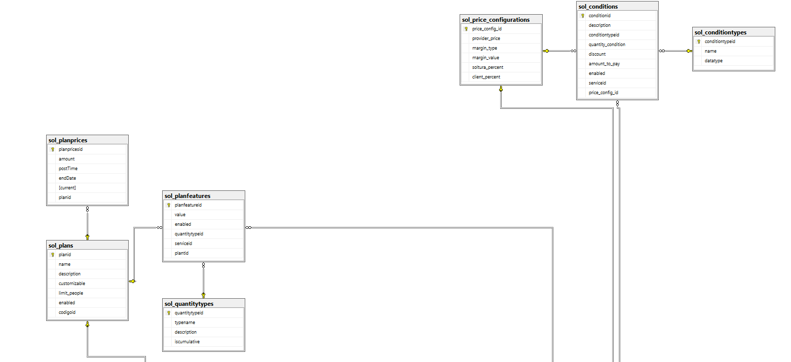
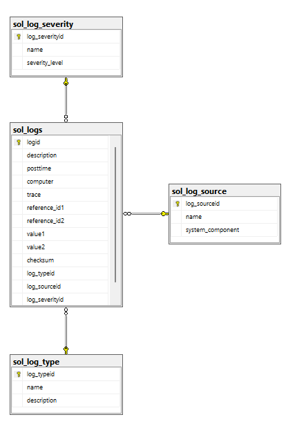
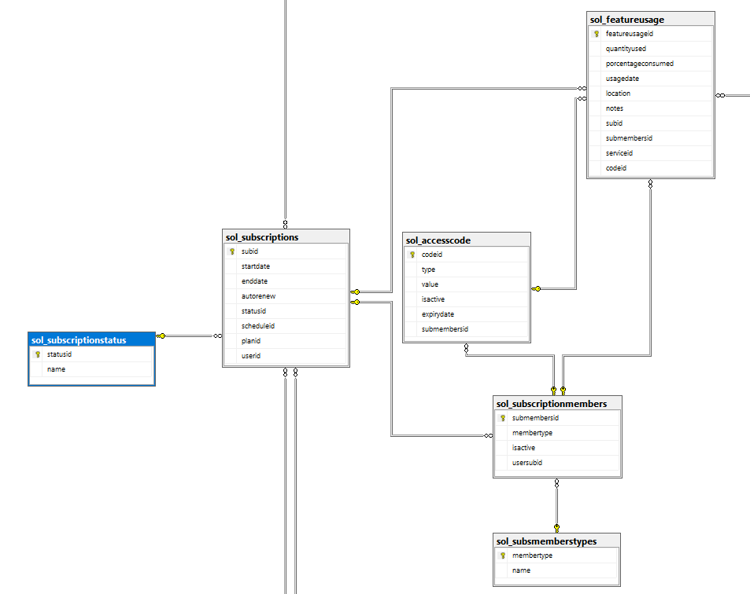
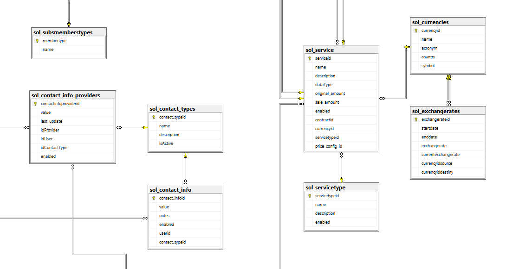
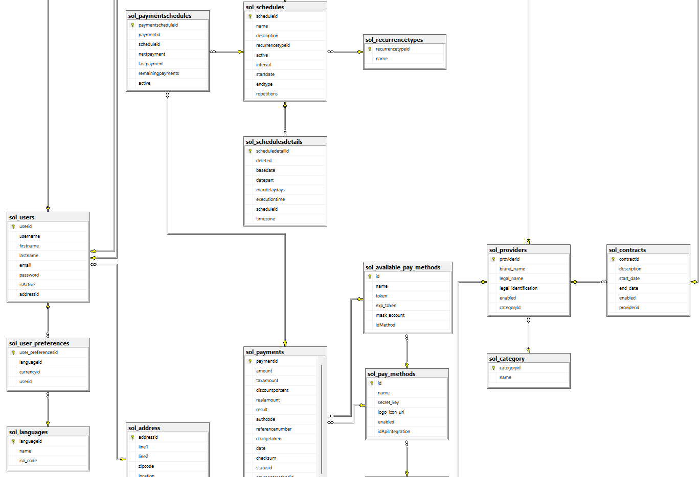
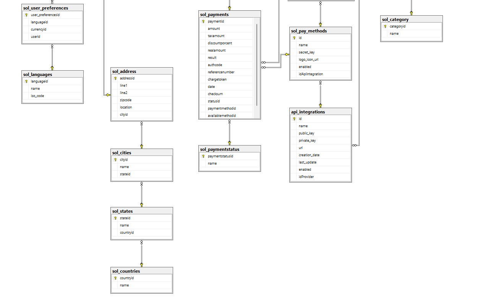

**Caso #2**

**Soltura**

IC-4301 Bases de Datos I

Instituto Tecnológico de Costa Rica

Campus Tecnológico Central Cartago

Escuela de Ingeniería en Computación

II Semestre 2024

Prof. Msc. Rodrigo Núñez Núñez

Carlos José Ávalos Mendieta

Carné: 2024207640

José Julián Monge Brenes

Carné: 2024247024

José Daniel Monterrosa Quirós
Carné: 2024084503

Rodrigo Sebastian Donoso Chaves

Carné: 2024070154

Fecha de entrega: 6 de mayo de 2025

# **Diseño de la base de datos**








```sql
USE SolturaDB;
GO

-- 1) Tablas base sin dependenciaS
CREATE TABLE dbo.sol_countries (
  countryid INT IDENTITY(1, 1) NOT NULL PRIMARY KEY,
  name VARCHAR(60)	NOT NULL,
);

CREATE TABLE dbo.sol_featuretype (
  featuretypeid INT IDENTITY(1,1) NOT NULL PRIMARY KEY,
  name          VARCHAR(50)      NOT NULL,
  enabled       BIT              NOT NULL DEFAULT 1,
  description   VARCHAR(255)     NULL
);
GO

CREATE TABLE dbo.sol_log_source (
  log_sourceid    INT IDENTITY(1,1) NOT NULL PRIMARY KEY,
  name             VARCHAR(100)   NOT NULL,
  system_component VARCHAR(100)   NOT NULL
);
GO

CREATE TABLE dbo.sol_recurrencetypes (
  recurrencetypeid INT IDENTITY(1,1) NOT NULL PRIMARY KEY,
  name             VARCHAR(20)     NOT NULL
);
GO

CREATE TABLE dbo.sol_category (
  categoryid INT IDENTITY(1,1) NOT NULL PRIMARY KEY,
  name       VARCHAR(75)       NOT NULL
);
GO

CREATE TABLE dbo.sol_subsmemberstypes (
  membertype INT IDENTITY(1,1) NOT NULL PRIMARY KEY,
  name       VARCHAR(50)        NOT NULL
);
GO

CREATE TABLE dbo.sol_subscriptionstatus (
  statusid INT IDENTITY(1,1) NOT NULL PRIMARY KEY,
  name     VARCHAR(20)      NOT NULL
);
GO

CREATE TABLE dbo.sol_currencies (
  currencyid INT IDENTITY(1,1) NOT NULL PRIMARY KEY,
  name       VARCHAR(50)      NOT NULL,
  acronym    VARCHAR(15)      NOT NULL,
  country    VARCHAR(45)      NOT NULL,
  symbol     VARCHAR(5)       NOT NULL
);
GO

CREATE TABLE dbo.sol_languages (
  languageid INT IDENTITY(1,1) NOT NULL PRIMARY KEY,
  name       VARCHAR(50)      NOT NULL,
  iso_code   CHAR(3)          NOT NULL
);
GO

CREATE TABLE dbo.sol_transactiontypes (
  transactiontypeid INT IDENTITY(1,1) NOT NULL PRIMARY KEY,
  name              VARCHAR(30)      NOT NULL
);
GO

CREATE TABLE dbo.sol_transactionsubtypes (
  transactionsubtypeid INT IDENTITY(1,1) NOT NULL PRIMARY KEY,
  name                 VARCHAR(30)      NOT NULL
);
GO

CREATE TABLE dbo.sol_conditiontypes (
  conditiontypeid INT IDENTITY(1,1) NOT NULL PRIMARY KEY,
  name            VARCHAR(75)       NOT NULL,
  datatype        VARCHAR(50)       NOT NULL
);
GO

CREATE TABLE dbo.sol_servicetype (
  servicetypeid INT IDENTITY(1,1) NOT NULL PRIMARY KEY,
  name          VARCHAR(75)       NOT NULL,
  description   VARCHAR(255)      NULL,
  enabled       BIT               NOT NULL DEFAULT 1
);
GO

CREATE TABLE dbo.sol_quantitytypes (
  quantitytypeid INT IDENTITY(1,1) NOT NULL PRIMARY KEY,
  typename       VARCHAR(50)        NOT NULL,
  description    TEXT               NULL,
  iscumulative   BIT                NOT NULL DEFAULT 1
);
GO

CREATE TABLE dbo.sol_plans (
  planid       INT IDENTITY(1,1) NOT NULL PRIMARY KEY,
  name         VARCHAR(75)       NOT NULL,
  description  TEXT              NULL,
  customizable BIT               NOT NULL DEFAULT 1,
  limit_people SMALLINT          NOT NULL,
  enabled      BIT               NOT NULL DEFAULT 1,
  codigoid     INT               NOT NULL
);
GO

-- 2) Tablas con dependencias simples
CREATE TABLE dbo.sol_states (
  stateid   INT IDENTITY(1,1) NOT NULL PRIMARY KEY,
  name      VARCHAR(60)      NOT NULL,
  countryid INT              NOT NULL,
  CONSTRAINT FK_sol_states_countryid FOREIGN KEY(countryid)
    REFERENCES dbo.sol_countries(countryid)
);
GO

CREATE TABLE dbo.sol_cities (
  cityid  INT IDENTITY(1,1) NOT NULL PRIMARY KEY,
  name    VARCHAR(60)      NOT NULL,
  stateid INT              NOT NULL,
  CONSTRAINT FK_sol_cities_stateid FOREIGN KEY(stateid)
    REFERENCES dbo.sol_states(stateid)
);
GO

CREATE TABLE dbo.sol_address (
  addressid INT IDENTITY(1,1) NOT NULL PRIMARY KEY,
  line1     VARCHAR(200)      NOT NULL,
  line2     VARCHAR(200)      NULL,
  zipcode   VARCHAR(9)        NOT NULL,
  location  GEOGRAPHY         NOT NULL,
  cityid    INT               NOT NULL,
  CONSTRAINT FK_sol_address_cityid FOREIGN KEY(cityid)
    REFERENCES dbo.sol_cities(cityid)
);
GO

CREATE TABLE dbo.sol_users (
  userid    INT IDENTITY(1,1) NOT NULL PRIMARY KEY,
  username  VARCHAR(100)      NOT NULL,
  firstname VARCHAR(100)      NOT NULL,
  lastname  VARCHAR(100)      NOT NULL,
  email     VARCHAR(150)      NOT NULL,
  password  VARBINARY(250)    NOT NULL,
  isActive  TINYINT           NOT NULL DEFAULT 1,
  addressid INT               NOT NULL,
  CONSTRAINT FK_sol_users_addressid FOREIGN KEY(addressid)
    REFERENCES dbo.sol_address(addressid)
);
GO

--CREATE TABLE dbo.sol_category(dummy INT);
-- sol_category ya creada arriba
--GO

CREATE TABLE dbo.sol_providers (
  providerid           INT IDENTITY(1,1) NOT NULL PRIMARY KEY,
  brand_name           VARCHAR(100)      NOT NULL,
  legal_name           VARCHAR(150)      NOT NULL,
  legal_identification VARCHAR(50)       NOT NULL,
  enabled              BIT               NOT NULL DEFAULT 1,
  categoryId           INT               NOT NULL,
  CONSTRAINT FK_sol_providers_categoryId FOREIGN KEY(categoryId)
    REFERENCES dbo.sol_category(categoryid)
);
GO

CREATE TABLE dbo.sol_contracts (
  contractid  INT IDENTITY(1,1) NOT NULL PRIMARY KEY,
  description VARCHAR(100)      NOT NULL,
  start_date  DATE              NOT NULL,
  end_date    DATE              NOT NULL,
  enabled     BIT               NOT NULL DEFAULT 1,
  providerid  INT               NOT NULL,
  CONSTRAINT FK_sol_contracts_providerid FOREIGN KEY(providerid)
    REFERENCES dbo.sol_providers(providerid)
);
GO

CREATE TABLE dbo.api_integrations (
  id            SMALLINT       IDENTITY(1,1) NOT NULL PRIMARY KEY,
  name          VARCHAR(80)     NOT NULL,
  public_key    VARCHAR(200)    NULL,
  private_key   VARCHAR(200)    NULL,
  url           VARCHAR(200)    NOT NULL,
  creation_date DATETIME        NOT NULL,
  last_update   DATETIME        NOT NULL,
  enabled       BIT             NOT NULL DEFAULT 1,
  idProvider    INT             NOT NULL,
  CONSTRAINT FK_api_integrations_idProvider FOREIGN KEY(idProvider)
    REFERENCES dbo.sol_providers(providerid)
);
GO

CREATE TABLE dbo.sol_pay_methods (
  id               INT IDENTITY(1,1) NOT NULL PRIMARY KEY,
  name             VARCHAR(75)      NOT NULL,
  secret_key       VARBINARY(255)   NOT NULL,
  logo_icon_url    VARCHAR(200)     NULL,
  enabled          BIT              NOT NULL DEFAULT 1,
  idApiIntegration SMALLINT         NOT NULL,
  CONSTRAINT FK_sol_pay_methods_idApiIntegration FOREIGN KEY(idApiIntegration)
    REFERENCES dbo.api_integrations(id)
);
GO

CREATE TABLE dbo.sol_available_pay_methods (
  id           INT IDENTITY(1,1) NOT NULL PRIMARY KEY,
  name         VARCHAR(50)      NOT NULL,
  token        VARCHAR(255)     NOT NULL,
  exp_token    DATE             NOT NULL,
  mask_account VARCHAR(50)      NULL,
  idMethod     INT              NOT NULL,
  CONSTRAINT FK_sol_available_pay_methods_idMethod FOREIGN KEY(idMethod)
    REFERENCES dbo.sol_pay_methods(id)
);
GO

CREATE TABLE dbo.sol_paymentstatus (
  paymentstatusid INT IDENTITY(1,1) NOT NULL PRIMARY KEY,
  name            VARCHAR(50)          NOT NULL
);
GO

CREATE TABLE dbo.sol_payments (
  paymentid         INT IDENTITY(1,1) NOT NULL PRIMARY KEY,
  amount            DECIMAL(10,2)     NOT NULL,
  taxamount         DECIMAL(10,2)     NOT NULL,
  discountporcent   DECIMAL(5,2)      NOT NULL,
  realamount        DECIMAL(10,2)     NOT NULL,
  result            VARCHAR(10)       NULL,
  authcode          VARCHAR(100)      NULL,
  referencenumber   VARCHAR(100)      NULL,
  chargetoken       VARBINARY(200)    NULL,
  date              DATETIME          NOT NULL,
  checksum          VARBINARY(250)    NULL,
  statusid          INT               NOT NULL,
  paymentmethodid   INT               NOT NULL,
  availablemethodid INT               NOT NULL,
  CONSTRAINT FK_sol_payments_availablemethodid FOREIGN KEY(availablemethodid)
    REFERENCES dbo.sol_available_pay_methods(id),
  CONSTRAINT FK_sol_payments_paymentmethodid FOREIGN KEY(paymentmethodid)
    REFERENCES dbo.sol_pay_methods(id),
  CONSTRAINT FK_sol_payments_statusid FOREIGN KEY(statusid)
    REFERENCES dbo.sol_paymentstatus(paymentstatusid)
);
GO

CREATE TABLE dbo.sol_exchangerates (
  exchangerateid      INT IDENTITY(1,1) NOT NULL PRIMARY KEY,
  startdate           DATETIME         NOT NULL,
  enddate             DATETIME         NULL,
  exchangerate        DECIMAL(10,4)    NOT NULL,
  currentexchangerate BIT              NOT NULL DEFAULT 1,
  currencyidsource    INT               NOT NULL,
  currencyiddestiny   INT               NOT NULL,
  CONSTRAINT FK_sol_exchangerates_currencyidsource FOREIGN KEY(currencyidsource)
    REFERENCES dbo.sol_currencies(currencyid),
  CONSTRAINT FK_sol_exchangerates_currencyiddestiny FOREIGN KEY(currencyiddestiny)
    REFERENCES dbo.sol_currencies(currencyid)
);
GO

CREATE TABLE dbo.sol_schedules (
  scheduleid       INT IDENTITY(1,1) NOT NULL PRIMARY KEY,
  name             VARCHAR(100)     NOT NULL,
  description      TEXT             NULL,
  recurrencetypeid INT              NOT NULL,
  active           BIT              NOT NULL DEFAULT 1,
  interval         INT              NOT NULL,
  startdate        DATETIME         NOT NULL,
  endtype          VARCHAR(20)      NOT NULL CHECK(endtype IN('DATE','REPETITIONS','NEVER')),
  repetitions      INT              NULL,
  CONSTRAINT FK_sol_schedules_recurrencetypeid FOREIGN KEY(recurrencetypeid)
    REFERENCES dbo.sol_recurrencetypes(recurrencetypeid)
);
GO

CREATE TABLE dbo.sol_schedulesdetails (
  scheduledetailid INT IDENTITY(1,1) NOT NULL PRIMARY KEY,
  deleted          BIT              NOT NULL DEFAULT 1,
  basedate         DATETIME         NOT NULL,
  datepart         VARCHAR(20)      NOT NULL,
  maxdelaydays     INT              NOT NULL,
  executiontime    DATETIME         NULL,
  scheduleid       INT              NOT NULL,
  timezone         VARCHAR(50)      NOT NULL,
  CONSTRAINT FK_sol_schedulesdetails_scheduleid FOREIGN KEY(scheduleid)
    REFERENCES dbo.sol_schedules(scheduleid)
);
GO

CREATE TABLE dbo.sol_paymentschedules (
  paymentscheduleid INT IDENTITY(1,1) NOT NULL PRIMARY KEY,
  paymentid         INT              NOT NULL,
  scheduleid        INT              NOT NULL,
  nextpayment       DATETIME         NOT NULL,
  lastpayment       DATETIME         NULL,
  remainingpayments INT              NULL,
  active            BIT              NOT NULL DEFAULT 1,
  CONSTRAINT FK_sol_paymentschedules_scheduleid FOREIGN KEY(scheduleid)
    REFERENCES dbo.sol_schedules(scheduleid),
  CONSTRAINT FK_sol_paymentschedules_paymentid FOREIGN KEY(paymentid)
    REFERENCES dbo.sol_payments(paymentid)
);
GO

CREATE TABLE dbo.sol_subscriptions (
  subid      INT IDENTITY(1,1) NOT NULL PRIMARY KEY,
  startdate  DATETIME          NOT NULL,
  enddate    DATETIME          NOT NULL,
  autorenew  BIT               NOT NULL DEFAULT 1,
  statusid   INT               NOT NULL,
  scheduleid INT               NOT NULL,
  planid     INT               NOT NULL,
  userid     INT               NOT NULL,
  CONSTRAINT FK_sol_subscriptions_statusid FOREIGN KEY(statusid)
    REFERENCES dbo.sol_subscriptionstatus(statusid),
  CONSTRAINT FK_sol_subscriptions_scheduleid FOREIGN KEY(scheduleid)
    REFERENCES dbo.sol_schedules(scheduleid),
  CONSTRAINT FK_sol_subscriptions_planid FOREIGN KEY(planid)
    REFERENCES dbo.sol_plans(planid),
  CONSTRAINT FK_sol_subscriptions_userid FOREIGN KEY(userid)
    REFERENCES dbo.sol_users(userid)
);
GO

CREATE TABLE dbo.sol_subscriptionmembers (
  submembersid INT IDENTITY(1,1) NOT NULL PRIMARY KEY,
  membertype   INT               NOT NULL,
  isactive     DATETIME          NOT NULL,
  usersubid    INT               NOT NULL,
  CONSTRAINT FK_sol_subscriptionmembers_membertype FOREIGN KEY(membertype)
    REFERENCES dbo.sol_subsmemberstypes(membertype),
  CONSTRAINT FK_sol_subscriptionmembers_usersubid FOREIGN KEY(usersubid)
    REFERENCES dbo.sol_subscriptions(subid)
);
GO

CREATE TABLE dbo.sol_accesscode (
  codeid       INT IDENTITY(1,1) NOT NULL PRIMARY KEY,
  type         VARCHAR(100)     NOT NULL,
  value        VARBINARY        NOT NULL,
  isactive     BIT              NOT NULL DEFAULT 1,
  expirydate   TIMESTAMP        NOT NULL,
  submembersid INT              NOT NULL,
  CONSTRAINT FK_sol_accesscode_submembersid FOREIGN KEY(submembersid)
    REFERENCES dbo.sol_subscriptionmembers(submembersid)
);
GO

CREATE TABLE dbo.sol_price_configurations (
  price_config_id INT IDENTITY(1,1) NOT NULL PRIMARY KEY,
  provider_price  DECIMAL(10,2)      NOT NULL,
  margin_type     VARCHAR(10)        NOT NULL,
  margin_value    DECIMAL(10,2)      NOT NULL,
  soltura_percent DECIMAL(5,2)       NOT NULL,
  client_percent  DECIMAL(5,2)       NOT NULL
);
GO

CREATE TABLE dbo.sol_service (
  serviceid       INT IDENTITY(1,1) NOT NULL PRIMARY KEY,
  name            VARCHAR(100)      NOT NULL,
  description     VARCHAR(100)      NOT NULL,
  dataType        VARCHAR(50)       NOT NULL,
  original_amount DECIMAL(10,2)     NOT NULL,
  sale_amount     DECIMAL(10,2)     NOT NULL,
  enabled         BIT               NOT NULL DEFAULT 1,
  contractid      INT               NOT NULL,
  currencyid      INT               NOT NULL,
  servicetypeid   INT               NOT NULL,
  price_config_id INT               NOT NULL,
  CONSTRAINT FK_sol_service_contractid       FOREIGN KEY(contractid)      REFERENCES dbo.sol_contracts(contractid),
  CONSTRAINT FK_sol_service_currencyid       FOREIGN KEY(currencyid)      REFERENCES dbo.sol_currencies(currencyid),
  CONSTRAINT FK_sol_service_servicetypeid    FOREIGN KEY(servicetypeid)   REFERENCES dbo.sol_servicetype(servicetypeid),
  CONSTRAINT FK_sol_service_priceconfig      FOREIGN KEY(price_config_id) REFERENCES dbo.sol_price_configurations(price_config_id)
);
GO

CREATE TABLE dbo.sol_conditions (
  conditionid       INT IDENTITY(1,1) NOT NULL PRIMARY KEY,
  description       VARCHAR(100)     NOT NULL,
  conditiontypeid   INT               NOT NULL,
  quantity_condition VARCHAR(100)    NOT NULL,
  discount          DECIMAL(5,2)     NOT NULL,
  amount_to_pay     DECIMAL(10,2)    NOT NULL,
  enabled           BIT              NOT NULL DEFAULT 1,
  serviceid         INT               NOT NULL,
  price_config_id   INT               NOT NULL,
  CONSTRAINT FK_sol_conditions_conditiontypeid FOREIGN KEY(conditiontypeid)
    REFERENCES dbo.sol_conditiontypes(conditiontypeid),
  CONSTRAINT FK_sol_conditions_serviceid       FOREIGN KEY(serviceid)
    REFERENCES dbo.sol_service(serviceid),
  CONSTRAINT FK_sol_conditions_priceconfig     FOREIGN KEY(price_config_id)
    REFERENCES dbo.sol_price_configurations(price_config_id)
);
GO

CREATE TABLE dbo.sol_planprices (
  planpricesid INT IDENTITY(1,1) NOT NULL PRIMARY KEY,
  amount       DECIMAL(10,2)     NOT NULL,
  postTime     DATETIME          NOT NULL,
  endDate      DATE              NOT NULL,
  [current]    BIT               NOT NULL DEFAULT 1,
  planid       INT               NOT NULL,
  CONSTRAINT FK_sol_planprices_planid FOREIGN KEY(planid)
    REFERENCES dbo.sol_plans(planid)
);
GO

CREATE TABLE dbo.sol_planfeatures (
  planfeatureid INT IDENTITY(1,1) NOT NULL PRIMARY KEY,
  value          VARCHAR(100)      NOT NULL,
  enabled        INT               NOT NULL DEFAULT 1,
  quantitytypeid INT               NOT NULL,
  serviceid      INT               NOT NULL,
  plantid        INT               NOT NULL,
  CONSTRAINT FK_sol_planfeatures_quantitytypeid FOREIGN KEY(quantitytypeid)
    REFERENCES dbo.sol_quantitytypes(quantitytypeid),
  CONSTRAINT FK_sol_planfeatures_serviceid FOREIGN KEY(serviceid)
    REFERENCES dbo.sol_service(serviceid),
  CONSTRAINT FK_sol_planfeatures_plantid FOREIGN KEY(plantid)
    REFERENCES dbo.sol_plans(planid)
);
GO

CREATE TABLE dbo.sol_featureusage (
  featureusageid     INT IDENTITY(1,1) NOT NULL PRIMARY KEY,
  quantityused       DECIMAL          NOT NULL,
  porcentageconsumed DECIMAL          NOT NULL,
  usagedate          TIMESTAMP        NULL,
  location           VARCHAR(255)     NULL,
  notes              TEXT             NULL,
  subid              INT               NOT NULL,
  submembersid       INT               NOT NULL,
  serviceid          INT               NOT NULL,
  codeid             INT               NOT NULL,
  CONSTRAINT FK_sol_featureusage_subid       FOREIGN KEY(subid)
    REFERENCES dbo.sol_subscriptions(subid),
  CONSTRAINT FK_sol_featureusage_submembersid FOREIGN KEY(submembersid)
    REFERENCES dbo.sol_subscriptionmembers(submembersid),
  CONSTRAINT FK_sol_featureusage_serviceid    FOREIGN KEY(serviceid)
    REFERENCES dbo.sol_service(serviceid),
  CONSTRAINT FK_sol_featureusage_codeid       FOREIGN KEY(codeid)
    REFERENCES dbo.sol_accesscode(codeid)
);
GO

CREATE TABLE dbo.sol_user_preferences (
  user_preferencesid INT IDENTITY(1,1) NOT NULL PRIMARY KEY,
  languageid         INT               NOT NULL,
  currencyid         INT               NOT NULL,
  userid             INT               NOT NULL,
  CONSTRAINT FK_sol_user_preferences_currencyid FOREIGN KEY(currencyid)
    REFERENCES dbo.sol_languages(languageid),
  CONSTRAINT FK_sol_user_preferences_userid FOREIGN KEY(userid)
    REFERENCES dbo.sol_users(userid)
);
GO

CREATE TABLE dbo.sol_log_severity (
  log_severityid INT IDENTITY(1,1) NOT NULL PRIMARY KEY,
  name           VARCHAR(50)       NOT NULL,
  severity_level BIT               NOT NULL DEFAULT 1
);
GO

CREATE TABLE dbo.sol_log_type (
  log_typeid INT IDENTITY(1,1) NOT NULL PRIMARY KEY,
  name       VARCHAR(100)    NOT NULL,
  description TEXT           NULL
);
GO

CREATE TABLE dbo.sol_logs (
  logid            INT IDENTITY(1,1) NOT NULL PRIMARY KEY,
  description      VARCHAR(200)     NOT NULL,
  posttime         DATETIME         NOT NULL,
  computer         VARCHAR(100)     NOT NULL,
  trace            TEXT             NULL,
  reference_id1    BIGINT           NULL,
  reference_id2    BIGINT           NULL,
  value1           VARCHAR(180)     NULL,
  value2           VARCHAR(180)     NULL,
  checksum         VARCHAR(45)      NOT NULL,
  log_typeid       INT              NOT NULL,
  log_sourceid     INT              NOT NULL,
  log_severityid   INT              NOT NULL,
  CONSTRAINT FK_sol_logs_log_typeid FOREIGN KEY(log_typeid)
    REFERENCES dbo.sol_log_type(log_typeid),
  CONSTRAINT FK_sol_logs_log_sourceid FOREIGN KEY(log_sourceid)
    REFERENCES dbo.sol_log_source(log_sourceid),
  CONSTRAINT FK_sol_logs_log_severityid FOREIGN KEY(log_severityid)
    REFERENCES dbo.sol_log_severity(log_severityid)
);
GO

CREATE TABLE dbo.sol_contact_types (
  contact_typeid INT IDENTITY(1,1) NOT NULL PRIMARY KEY,
  name           VARCHAR(50)     NOT NULL,
  description    VARCHAR(255)    NULL,
  isActive       TINYINT         NOT NULL DEFAULT 1
);
GO

CREATE TABLE dbo.sol_contact_info (
  contact_infoid INT IDENTITY(1,1) NOT NULL PRIMARY KEY,
  value          VARCHAR(255)    NOT NULL,
  notes          VARCHAR(255)    NULL,
  enabled        BIT             NOT NULL DEFAULT 1,
  userid         INT             NOT NULL,
  contact_typeid INT             NOT NULL,
  CONSTRAINT FK_sol_contact_info_userid FOREIGN KEY(userid)
    REFERENCES dbo.sol_users(userid),
  CONSTRAINT FK_sol_contact_info_contact_typeid FOREIGN KEY(contact_typeid)
    REFERENCES dbo.sol_contact_types(contact_typeid)
);
GO

CREATE TABLE dbo.sol_contact_info_providers (
  contactinfoproviderid INT IDENTITY(1,1) NOT NULL PRIMARY KEY,
  value                 VARCHAR(100)         NOT NULL,
  last_update           DATETIME             NOT NULL,
  idProvider            INT                  NOT NULL,
  idUser                INT                  NOT NULL,
  idContactType         INT                  NOT NULL,
  enabled               BIT                  NOT NULL DEFAULT 1,
  CONSTRAINT FK_sol_contact_info_providers_providerid FOREIGN KEY(idProvider)
    REFERENCES dbo.sol_providers(providerid),
  CONSTRAINT FK_sol_contact_info_providers_userid FOREIGN KEY(idUser)
    REFERENCES dbo.sol_users(userid),
  CONSTRAINT FK_sol_contact_info_providers_contact_type FOREIGN KEY(idContactType)
    REFERENCES dbo.sol_contact_types(contact_typeid)
);
GO

CREATE TABLE dbo.sol_migrated_users (
  userid            INT NOT NULL PRIMARY KEY,
  platform_name     VARCHAR(100) NOT NULL DEFAULT 'Payment Assistant',
  password_changed  BIT NOT NULL DEFAULT 0,
  CONSTRAINT FK_migrated_user FOREIGN KEY(userid)
    REFERENCES dbo.sol_users(userid)
);
GO

CREATE TABLE dbo.sol_modules (
  moduleid TINYINT IDENTITY(1,1) NOT NULL PRIMARY KEY,
  name VARCHAR(50) NOT NULL
);
GO

CREATE TABLE dbo.sol_roles (
  roleid INT IDENTITY(1,1) NOT NULL PRIMARY KEY,
  rolename VARCHAR(45) NOT NULL,
  description VARCHAR(100) NOT NULL,
  asignationdate DATETIME NOT NULL DEFAULT GETDATE(),
  is_system_role BIT NOT NULL DEFAULT 0
);
GO

CREATE TABLE dbo.sol_permissions (
  permissionid INT IDENTITY(1,1) NOT NULL PRIMARY KEY,
  permissioncode VARCHAR(10) NOT NULL,
  description VARCHAR(100) NOT NULL,
  htmlObjectid VARCHAR(250) NOT NULL,
  moduleid TINYINT NOT NULL,
  CONSTRAINT FK_sol_permissions_moduleid FOREIGN KEY (moduleid)
    REFERENCES dbo.sol_modules (moduleid)
);
GO

CREATE TABLE dbo.sol_rolespermissions (
  rolepermissionsid INT IDENTITY(1,1) NOT NULL PRIMARY KEY,
  asignationdate DATETIME NOT NULL DEFAULT GETDATE(),
  enable BIT NOT NULL DEFAULT 1,
  deleted BIT NOT NULL DEFAULT 0,
  lastupdate DATETIME NOT NULL DEFAULT GETDATE(),
  checksum VARBINARY(250) NOT NULL,
  roleid INT NOT NULL,
  permissionid INT NOT NULL,
  CONSTRAINT FK_sol_rolespermissions_roleid FOREIGN KEY (roleid)
    REFERENCES dbo.sol_roles (roleid),
  CONSTRAINT FK_sol_rolespermissions_permissionid FOREIGN KEY (permissionid)
    REFERENCES dbo.sol_permissions (permissionid)
);
GO

CREATE TABLE dbo.sol_usersroles (
  usersrolesid INT IDENTITY(1,1) NOT NULL PRIMARY KEY,
  asignationdate DATETIME NOT NULL DEFAULT GETDATE(),
  checksum VARBINARY(250) NOT NULL,
  enable BIT NOT NULL DEFAULT 1,
  deleted BIT NOT NULL DEFAULT 0,
  roleid INT NOT NULL,
  userid INT NOT NULL,
  CONSTRAINT FK_sol_usersroles_roleid FOREIGN KEY (roleid)
    REFERENCES dbo.sol_roles (roleid),
  CONSTRAINT FK_sol_usersroles_userid FOREIGN KEY (userid)
    REFERENCES dbo.sol_users (userid)
);
GO
```

# **Test de la base de datos**
Ahora que ya Soltura cuenta con un diseño de base de datos aprobados por los ingenieros, CTO, contrapartes ingenieros de Soltura, se les ha pedido que realicen pruebas contextuales para medir el comportamiento, técnicas, rendimiento y semántica de la base de datos diseñada en SQL Server. A continuación se detallan todos los test requeridos.

## **Población de datos**
Una vez aprobado el diseño de base de datos, ocupamos los scripts de llenado para la base de datos [Script de inserción completo](scriptInsercion.sql)

El sistema opera al menos con dos monedas
Inserción senciila de dos monedas en la tabla sol_currencies
```sql
INSERT INTO sol_currencies(name, acronym, country, symbol)
VALUES
  ('Colón costarricense', 'CRC', 'Costa Rica', '₡'),
  ('Dólar estadounidense', 'USD', 'Estados Unidos', '$');
```

Cargar los catálogos base del sistema: tipos de servicios (gimnasios, salud, parqueos, etc.), tipos de planes, métodos de pago, monedas, estados de suscripción, etc.
Se realiza inserción de datos, en tablas que son necesarias para la inserción de otras tablas.
```sql
-- sol_servicetype
INSERT INTO sol_servicetype(name)
VALUES
  ('Gimnasios'),
  ('Salud'),
  ('Parqueos'),
  ('Coworking'),
  ('Educación'),
  ('Streaming'),
  ('Comida saludable');

-- sol_subscriptionstatus
INSERT INTO sol_subscriptionstatus(name)
VALUES
  ('Activa'),
  ('Inactiva'),
  ('Cancelada');

-- sol_category
INSERT INTO sol_category(name)
VALUES
  ('Gimnasios'),
  ('Salud'),
  ('Educación'),
  ('Streaming'),
  ('Comida saludable');

-- sol_providers
INSERT INTO sol_providers(brand_name, legal_name, legal_identification, enabled, categoryId)
VALUES
  ('Spotify',             'Spotify S.A.',              '3101123456', 1, 4),
  ('Netflix',             'Netflix Inc.',              '3101123457', 1, 4),
  ('Smart Fit',           'Smart Fit Costa Rica',      '3101123458', 1, 1),
  ('Vindi Supermercados', 'Vindi S.A.',                '3101123459', 1, 2),
  ('Puma Energy',         'Puma Energy Centroamérica', '3101123460', 1, 5),
  ('Cinemark',            'Cinemark C.R.',             '3101123461', 1, 3),
  ('Amazon Prime Video',  'Amazon Corp.',              '3101123462', 1, 4);

-- api_integrations
INSERT INTO api_integrations(name, public_key, private_key, url, creation_date, last_update, enabled, idProvider)
VALUES
  ('Integración BAC',    'public_bac',   'private_bac',   'https://api.bac.com',      GETDATE(), GETDATE(), 1, 1),
  ('Integración SINPE',  'public_sinpe', 'private_sinpe', 'https://api.sinpe.fi.cr',  GETDATE(), GETDATE(), 1, 2),
  ('Integración PayPal', 'pk_paypal',    'sk_paypal',     'https://api.paypal.com',   GETDATE(), GETDATE(), 1, 3),
  ('Integración SINPE',  'pk_sinpe',     'sk_sinpe',      'https://api.sinpe.fi.cr',  GETDATE(), GETDATE(), 1, 4);

-- sol_pay_methods
INSERT INTO sol_pay_methods(name, secret_key, logo_icon_url, enabled, idApiIntegration)
VALUES
  ('Tarjeta de Crédito',     CONVERT(VARBINARY(255),'clave_bac'),    'https://logo.bac.com/card.png',     1, 1),
  ('Transferencia Bancaria', CONVERT(VARBINARY(255),'clave_bn'),     'https://logo.bncr.fi.cr/bank.png',  1, 2),
  ('PayPal',                 CONVERT(VARBINARY(255),'clave_paypal'), 'https://logo.paypal.com/paypal.png',1, 3),
  ('Sinpe Móvil',            CONVERT(VARBINARY(255),'clave_sinpe'),  'https://logo.sinpe.fi.cr/sinpe.png',1, 4);

-- sol_available_pay_methods
INSERT INTO sol_available_pay_methods(name, token, exp_token, mask_account, idMethod)
VALUES
  ('Tarjeta de Crédito BAC',     'tok_bac_ABC123',    DATEADD(MONTH,6,GETDATE()), '****4321', 1),
  ('Transferencia Bancaria BNCR','tok_bncr_DEF456',   DATEADD(MONTH,6,GETDATE()), NULL,      2),
  ('PayPal principal',            'tok_paypal_GHI789', DATEADD(MONTH,6,GETDATE()), 'user@****.com', 3),
  ('Sinpe Móvil',                 'tok_sinpe_JKL012',  DATEADD(MONTH,6,GETDATE()), '8888-****',     4);

-- sol_recurrencetypes
INSERT INTO sol_recurrencetypes(name)
VALUES
  ('Diaria'),
  ('Semanal'),
  ('Mensual'),
  ('Trimestral'),
  ('Anual');

-- sol_schedules
INSERT INTO sol_schedules(name, description, recurrencetypeid, active, [interval], startdate, endtype, repetitions)
VALUES
  ('Mensual',    'Pago mensual',       1, 1,  30, GETDATE(), 'NEVER', NULL),
  ('Trimestral', 'Pago cada 3 meses',  1, 1,  90, GETDATE(), 'NEVER', NULL),
  ('Anual',      'Pago anual',         1, 1, 365, GETDATE(), 'NEVER', NULL),
  ('Semanal',    'Pago semanal',       1, 1,   7, GETDATE(), 'NEVER', NULL),
  ('Bimestral',  'Pago bimestral',     1, 1,  60, GETDATE(), 'NEVER', NULL),
  ('Semestral',  'Pago semestral',     1, 1, 180, GETDATE(), 'NEVER', NULL),
  ('Diario',     'Pago diario',        1, 1,   1, GETDATE(), 'NEVER', NULL),
  ('Especial',   'Condición especial', 1, 1,  15, GETDATE(), 'NEVER', NULL),
  ('Bienal',     'Cada dos años',      1, 1, 730, GETDATE(), 'NEVER', NULL);

-- sol_countries
INSERT INTO sol_countries(name)
VALUES
  ('Costa Rica'),
  ('México'),
  ('Guatemala'),
  ('El Salvador'),
  ('Honduras'),
  ('Nicaragua'),
  ('Panamá'),
  ('Colombia'),
  ('Perú'),
  ('Chile');

-- sol_states
INSERT INTO sol_states(name, countryid)
VALUES
  ('San José',          1),
  ('Alajuela',          1),
  ('Jalisco',           2),
  ('Nuevo León',        2),
  ('Guatemala',         3),
  ('Petén',             3),
  ('San Salvador',      4),
  ('La Libertad',       4),
  ('Francisco Morazán', 5),
  ('Cortés',            5),
  ('León',              6),
  ('Granada',           6),
  ('Panamá',            7),
  ('Chiriquí',          7),
  ('Bogotá D.C.',       8),
  ('Antioquia',         8),
  ('Lima',              9),
  ('Cusco',             9),
  ('Santiago',         10),
  ('Valparaíso',       10);

-- sol_cities
INSERT INTO sol_cities(name, stateid)
VALUES
  ('San Pedro',           1),
  ('Escazú',              1),
  ('Quesada',             2),
  ('San Ramón',           2),
  ('Guadalajara',         3),
  ('Tepatitlán',          3),
  ('Monterrey',           4),
  ('San Nicolás',         4),
  ('Mixco',               5),
  ('Villa Nueva',         5),
  ('Flores',              6),
  ('Melchor de Mencos',   6),
  ('Soyapango',           7),
  ('Ilopango',            7),
  ('Santa Tecla',         8),
  ('Zaragoza',            8),
  ('Tegucigalpa',         9),
  ('Comayagüela',         9),
  ('San Pedro Sula',     10),
  ('Puerto Cortés',      10),

-- sol_contracts sin especificar el contratoId (IDENTITY lo genera)
INSERT INTO sol_contracts(description, start_date, end_date, enabled, providerid)
VALUES
  ('Contrato con Spotify',             GETDATE(), DATEADD(YEAR,1,GETDATE()), 1, 1),
  ('Contrato con Netflix',             GETDATE(), DATEADD(YEAR,1,GETDATE()), 1, 2),
  ('Contrato con Smart Fit',           GETDATE(), DATEADD(YEAR,1,GETDATE()), 1, 3),
  ('Contrato con Vindi Supermercados', GETDATE(), DATEADD(YEAR,1,GETDATE()), 1, 4),
  ('Contrato con Puma Energy',         GETDATE(), DATEADD(YEAR,1,GETDATE()), 1, 5),
  ('Contrato con Cinemark',            GETDATE(), DATEADD(YEAR,1,GETDATE()), 1, 6),
  ('Contrato con Amazon Prime Video',  GETDATE(), DATEADD(YEAR,1,GETDATE()), 1, 7);

-- sol_price_configurations sin especificar el price_config_id (IDENTITY lo genera)
INSERT INTO sol_price_configurations(provider_price, margin_type, margin_value, soltura_percent, client_percent)
VALUES
  (100.00, 'Porcentaje', 20.00, 50.00, 50.00);
```

Carga de al menos 40 usuarios en el sistema
Se realizó un algoritmo para crear n cantidad de usuarios, usando variables, arreglos simulados y creaciones aleatorias para darle variedad a los usuarios y que no sean del mismo sitio o tengan el mismo nombre
```sql
-- Creación de los Usuarios
DECLARE @UserCount INT = 40;

-- Arreglos simulados
DECLARE @FirstNames TABLE (Name VARCHAR(100));
DECLARE @LastNames TABLE (Surname VARCHAR(100));
DECLARE @EmailDomains TABLE (Domain VARCHAR(100));

INSERT INTO @FirstNames VALUES ('Carlos'), ('María'), ('José'), ('Ana'), ('Luis'), ('Laura'), ('David'), ('Carmen');
INSERT INTO @LastNames VALUES ('Ramírez'), ('González'), ('Fernández'), ('Rojas'), ('Soto'), ('Vargas'), ('Pérez'), ('Jiménez');
INSERT INTO @EmailDomains VALUES ('@gmail.com'), ('@hotmail.com'), ('@outlook.com');

DECLARE @i INT = 1;

WHILE @i <= @UserCount
BEGIN
    DECLARE @FirstName VARCHAR(100) = (SELECT TOP 1 Name FROM @FirstNames ORDER BY NEWID());
    DECLARE @LastName VARCHAR(100) = (SELECT TOP 1 Surname FROM @LastNames ORDER BY NEWID());
    DECLARE @EmailDomain VARCHAR(100) = (SELECT TOP 1 Domain FROM @EmailDomains ORDER BY NEWID());

    DECLARE @Username VARCHAR(100) = LOWER(@FirstName + LEFT(@LastName, 2) + CAST(@i AS VARCHAR));
    DECLARE @Email VARCHAR(150) = LOWER(@FirstName + '.' + @LastName + CAST(@i AS VARCHAR) + @EmailDomain);

    -- Crear dirección aleatoria
    DECLARE @CityId INT = (SELECT TOP 1 cityid FROM sol_cities ORDER BY NEWID());

	-- Crear coordenadas aleatorias
    DECLARE @Lat FLOAT = 9.9 + (RAND() * 0.2);
    DECLARE @Lon FLOAT = -84.2 + (RAND() * 0.2);

    INSERT INTO sol_address (line1, line2, zipcode, location, cityid)
    VALUES (
        'Calle ' + CAST((ABS(CHECKSUM(NEWID())) % 100 + 1) AS VARCHAR),
        'Casa ' + CAST((ABS(CHECKSUM(NEWID())) % 200 + 1) AS VARCHAR),
        CAST((10000 + ABS(CHECKSUM(NEWID())) % 90000) AS VARCHAR),
        geography::Point(@Lat, @Lon, 4326),
        @CityId
    );

    -- Insertar usuario con address generado
    INSERT INTO sol_users (username, firstname, lastname, email, password, isActive, addressid)
    VALUES (@Username, @FirstName, @LastName, @Email, 0x70617373776F7264, 1, @i);

    SET @i = @i + 1;
END
```

Llenar la tabla de planes de suscripción, con variaciones como: Joven deportista, Familia de Verano, Viajero frecuente, Nomada Digiital, etc.
Se hace un llenado de planes para suscribirse.
```sql

-- sol_plans
INSERT INTO sol_plans(name, description, customizable, limit_people, enabled, codigoid)
VALUES
  ('Joven deportista',   'Ideal para jóvenes entre 18-25 con enfoque en gimnasios y salud', 1, 7, 1, 101),
  ('Familia de Verano',  'Planes para familias en época de vacaciones, incluye parqueos y comida', 1, 10, 1, 102),
  ('Viajero frecuente',  'Acceso a parqueos y coworkings en diferentes zonas',               1, 6, 1, 103),
  ('Nómada Digital',     'Acceso a coworking, gimnasio y educación continua',                1, 8, 1, 104),
  ('Estudiante Streaming','Ideal para estudiantes que consumen educación y entretenimiento',1, 5, 1, 105),
  ('Oficina Saludable',  'Planes para oficinas que ofrecen salud y comida saludable',        1, 9, 1, 106),
  ('Movilidad Total',    'Parqueo, coworking y comida saludable en un solo paquete',         1, 6, 1, 107),
  ('Pro Plus',           'Servicios premium para profesionales',                           1, 8, 1, 108),
  ('Básico Urbano',      'Servicios básicos para el trabajador urbano',                      1, 7, 1, 109);
```

Incluir al menos 7 empresas proveedoras de servicios (Ya fueron incluidas anteriormente, esto para poder crear las API_integrations), cada uno ofreciendo 2 a 4 combinaciones de servicios que se deben usar para crear de 7 a 9 planes diferentes.
En este script por medio de los contratos con los proveedores ya creados, se le asignara a cada proveedor de 2 a 4 servicios que brindar.
Todo esto por medio de un algoritmo
Primero se definen los dataTypes que va a ocupar cierto servicio en concreto
Luego se definen las variables con las que vamos a crear los servicios, posteriormente se va usar cursor en la tabla de sol_contracts para que cada contrato con un proveedor ofrezca de 2 a 4 servicios
De igual forma se utiliza aleatoridad para darle más variedad a los servicios.
```sql
-- Definir posibles dataTypes
DECLARE @ServiceTypes TABLE (typeid INT IDENTITY(1,1), typeName VARCHAR(50));
INSERT INTO @ServiceTypes(typeName)
VALUES
  ('Subscripcion'),
  ('Dinero'),
  ('Cantidad'),
  ('Duracion'),
  ('Porcentaje');

DECLARE 
  @nextServiceId  INT = 1,
  @contractId     INT,
  @numServices    INT,
  @svcCounter     INT,
  @typeCount      INT,
  @pick           INT,
  @dataType       VARCHAR(50),
  @randVal        INT;

-- Contar cuántos tipos tenemos
SELECT @typeCount = COUNT(*) FROM @ServiceTypes;

-- Recorrer cada contrato
DECLARE contract_cursor CURSOR FOR 
  SELECT contractid FROM sol_contracts;
OPEN contract_cursor;
FETCH NEXT FROM contract_cursor INTO @contractId;

WHILE @@FETCH_STATUS = 0
BEGIN
  -- Determinar aleatoriamente entre 2 y 4 servicios
  SET @numServices = ABS(CHECKSUM(NEWID())) % 3 + 2;
  SET @svcCounter  = 1;

  WHILE @svcCounter <= @numServices
  BEGIN
    -- Elegir un dataType al azar
    SET @pick = ABS(CHECKSUM(NEWID())) % @typeCount + 1;
    SELECT @dataType = typeName FROM @ServiceTypes WHERE typeid = @pick;

    -- Elegir currencyid aleatorio entre 1 y 2
    SET @randVal = ABS(CHECKSUM(NEWID())) % 2 + 1;
    
    -- Elegir servicetypeid aleatorio entre 1 y 7
    DECLARE @randSvcType INT = ABS(CHECKSUM(NEWID())) % 7 + 1;

    SET @nextServiceId = @nextServiceId + 1;

    INSERT INTO sol_service
      (name,description,dataType,original_amount,sale_amount,enabled,contractid,currencyid,servicetypeid,price_config_id)
    VALUES
      (
        'Srv_' + CAST(@contractId AS VARCHAR(5)) + '_' + CAST(@svcCounter AS VARCHAR(2)),
        'Srv ' + CAST(@svcCounter AS VARCHAR(2)) + ' para contrato ' + CAST(@contractId AS VARCHAR(5)),
        @dataType,
        CAST(ROUND((RAND(CHECKSUM(NEWID())) * 200 + 50), 2) AS DECIMAL(10,2)),
        CAST(ROUND((RAND(CHECKSUM(NEWID())) * 200 + 50) * 1.2, 2) AS DECIMAL(10,2)),
        1,
        @contractId,
        @randVal,
        @randSvcType,
        1   -- price_config_id
      );

    SET @svcCounter = @svcCounter + 1;
  END

  FETCH NEXT FROM contract_cursor INTO @contractId;
END

CLOSE contract_cursor;
DEALLOCATE contract_cursor;

SELECT * FROM dbo.sol_service
```
Ahora con estos servicios creados, por medio de cursor, a cada plan se le asignarán los diferentes servicios, tambien se realiza una insercion necesaria en la tabla quantitytypes por las llaves foraneas
Este cursor es de la tabla sol_plans, donde en cada plan creado se le va a asociar los servicios anteriormente creados
```sql
INSERT INTO sol_quantitytypes(typename,description,iscumulative)
VALUES
('UNIDAD','Cantidad de unidades',1),
('PORCENTAJE','Porcentaje aplicado',0),
('HORAS','Duración en horas',1),
('DÍAS','Duración en días',1),
('MONTO','Cantidad monetaria',1);

DECLARE 
  @nextPlanFeatureId INT = 1,
  @idplan           INT,
  @services       INT,
  @conta        INT,
  @sid               INT;

DECLARE plan_cursor CURSOR FOR
  SELECT planid
    FROM sol_plans
   ORDER BY planid;

OPEN plan_cursor;
FETCH NEXT FROM plan_cursor INTO @idplan;

WHILE @@FETCH_STATUS = 0
BEGIN
  -- Número aleatorio de servicios (2–4) para este plan
  SET @services = ABS(CHECKSUM(NEWID())) % 3 + 2;
  SET @conta  = 1;

  WHILE @conta <= @services
  BEGIN
    -- Elegir un servicio no asignado aún a este plan
    SELECT TOP 1 @sid = serviceid
      FROM sol_service
     WHERE serviceid NOT IN (
           SELECT serviceid 
             FROM sol_planfeatures 
            WHERE plantid = @idplan
         )
     ORDER BY NEWID();

    -- Asignar nuevo planfeatureid
    SET @nextPlanFeatureId = @nextPlanFeatureId + 1;

	DECLARE @qtid INT = ABS(CHECKSUM(NEWID())) % 5 + 1;

    INSERT INTO sol_planfeatures
      (value, enabled, quantitytypeid, serviceid, plantid)
    VALUES ('1', 1, @qtid, @sid, @idplan);

    SET @conta = @conta + 1;
  END

  FETCH NEXT FROM plan_cursor INTO @idplan;
END

CLOSE plan_cursor;
DEALLOCATE plan_cursor;
```
Para cada plan de servicios, debe haber 3 a 6 subscripciones a usuarios diferentes no repetidos en otra combinación (Se le resta a UserCount 5 que son los 5 usuarios sin subscripción).
```sql
SET @UserCount = @UserCount - 5;

-- Para cada uno de los 9 planes existentes, generar un número aleatorio de suscripciones (3–6)
DECLARE @PlanCounts TABLE (planid INT PRIMARY KEY, cnt INT);
INSERT INTO @PlanCounts(planid,cnt)
SELECT
  planid,
  ABS(CHECKSUM(NEWID(),planid)) % 4 + 3
FROM sol_plans;

-- 1) NumberedUsers: toma los primeros @UserCount números del sistema (1..@UserCount),
--    los baraja al azar (ORDER BY NEWID()) y los expone como posibles userids.
WITH NumberedUsers AS (
    SELECT TOP(@UserCount)
        number AS userid     -- cada número here representará un userid ficticio
    FROM master..spt_values
    WHERE type = 'P'
      AND number BETWEEN 1 AND @UserCount
    ORDER BY NEWID()         -- barajamos aleatoriamente el listado de usuarios
),
-- 2) AssignedUsers: a esos userids aleatorios les asigna un ROW_NUMBER secuencial,
--    para poder luego mapear rangos de filas a cada plan.
AssignedUsers AS (
    SELECT
        ROW_NUMBER() OVER(ORDER BY (SELECT NULL)) AS rownum,  -- número de fila 1..@UserCount
        userid                                               -- el userid barajado
    FROM NumberedUsers
),
-- 3) PlanSegments: para cada plan en @PlanCounts, calcula un rango
--    [startRow, endRow] basado en sumas acumuladas de cnt.
--    startRow = suma acumulada hasta este plan menos cnt + 1  
--    endRow   = suma acumulada hasta este plan
PlanSegments AS (
    SELECT
        planid,
        cnt,
        SUM(cnt) OVER (ORDER BY planid
                       ROWS BETWEEN UNBOUNDED PRECEDING AND CURRENT ROW)
          - cnt + 1   AS startRow,  -- primera fila asignada a este plan
        SUM(cnt) OVER (ORDER BY planid
                       ROWS BETWEEN UNBOUNDED PRECEDING AND CURRENT ROW)
          AS endRow     -- última fila asignada a este plan
    FROM @PlanCounts
)
-- Con estos segmentos y AssignedUsers ya podemos unir:
--   ROW_NUMBER entre startRow y endRow → a ese plan
--   y quedarle un userid único a cada subcripción.

-- Insertar suscripciones asignando planid por registro
INSERT INTO sol_subscriptions
  (startdate, enddate, autorenew, statusid, scheduleid, userid, planid)
SELECT
  GETDATE()                                              AS startdate,
  DATEADD(YEAR,1,GETDATE())                              AS enddate,
  1                                                      AS autorenew,
  1                                                      AS statusid,
  ps.planid                                              AS scheduleid,  -- si scheduleid coincide con planid
  au.userid                                              AS userid,
  ps.planid                                              AS planid
FROM PlanSegments ps
JOIN AssignedUsers au
  ON au.rownum BETWEEN ps.startRow AND ps.endRow;
```

## **Demostraciones T-SQL**
```sql
-- ===============================================
-- 1 y 2. CURSORES LOCAL Y GLOBAL
-- ===============================================
```
Los cursores permiten procesar filas una por una en T-SQL.
- Cursor LOCAL: Solo visible en la sesión actual donde se declara
- Cursor GLOBAL: Visible desde otras sesiones y procedimientos
Esta demostración muestra la declaración, apertura, lectura y cierre de ambos tipos.
```sql
DECLARE @planid INT, @planname VARCHAR(75);

-- Cursores LOCAL solo visibles en la sesión actual
DECLARE plan_cursor LOCAL CURSOR FOR 
SELECT planid, name FROM sol_plans WHERE enabled = 1;

DECLARE @userid INT, @username VARCHAR(100);

-- Cursores GLOBAL visibles desde otras sesiones
DECLARE user_cursor GLOBAL CURSOR FOR 
SELECT userid, username FROM sol_users WHERE isActive = 1;


OPEN plan_cursor;
FETCH NEXT FROM plan_cursor INTO @planid, @planname;
PRINT 'Primer plan (cursor LOCAL): ID=' + CAST(@planid AS VARCHAR) + ', Nombre=' + @planname;
CLOSE plan_cursor;
DEALLOCATE plan_cursor;

OPEN user_cursor;
FETCH NEXT FROM user_cursor INTO @userid, @username;
PRINT 'Primer usuario (cursor GLOBAL): ID=' + CAST(@userid AS VARCHAR) + ', Usuario=' + @username;
CLOSE user_cursor;

DEALLOCATE user_cursor;
GO

-- ===============================================
-- 3. TRIGGER con 4. RECOMPILACIÓN
-- ===============================================
```
1. La creación de un TRIGGER que se ejecuta automáticamente después de una inserción
2. El uso de sp_recompile para forzar la regeneración del plan de ejecución de un objeto
   La recompilación puede ser útil cuando las estadísticas o datos cambian significativamente

El trigger registra los pagos insertados y fuerza la recompilación del plan de ejecución
para garantizar un rendimiento óptimo tras cambios en los datos.

```sql
IF NOT EXISTS (SELECT * FROM sys.tables WHERE name = 'sol_payment_logs')
BEGIN
    CREATE TABLE dbo.sol_payment_logs (
        log_id INT IDENTITY(1,1) PRIMARY KEY,
        payment_id INT NOT NULL,
        amount DECIMAL(10,2) NOT NULL,
        action_type VARCHAR(20) NOT NULL,
        action_date DATETIME NOT NULL DEFAULT GETDATE(),
        user_id VARCHAR(50) NOT NULL DEFAULT SYSTEM_USER
    );
END;

-- Crear trigger para pagos 
CREATE OR ALTER TRIGGER trg_sol_payments_insert
ON dbo.sol_payments
AFTER INSERT
AS
BEGIN
    SET NOCOUNT ON;
    
    -- Registrar el pago en la tabla de logs
    INSERT INTO sol_payment_logs (payment_id, amount, action_type)
    SELECT paymentid, amount, 'INSERT'
    FROM inserted;
    
    -- Usar sp_recompile para forzar la recompilación del plan de ejecución
    -- de un procedimiento relacionado con pagos
    EXEC sp_recompile 'dbo.sol_payments';
    
    PRINT 'Pago registrado y se ha forzado la recompilación del plan de ejecución.';
END;
GO
```
Este procedimiento almacenado recorre todos los procedimientos de la base de datos
y ejecuta sp_recompile en cada uno, lo que fuerza la regeneración de todos los planes
de ejecución en caso de cambios estructurales importantes en la base de datos.

```sql
CREATE OR ALTER PROCEDURE dbo.RecompileAllProcedures
AS
BEGIN
    SET NOCOUNT ON;
    
    DECLARE @procname NVARCHAR(255);
    DECLARE proc_cursor CURSOR FOR
        SELECT ROUTINE_NAME FROM INFORMATION_SCHEMA.ROUTINES
        WHERE ROUTINE_TYPE = 'PROCEDURE' AND ROUTINE_SCHEMA = 'dbo';
    
    OPEN proc_cursor;
    FETCH NEXT FROM proc_cursor INTO @procname;
    
    WHILE @@FETCH_STATUS = 0
    BEGIN
        BEGIN TRY
            EXEC sp_recompile @procname;
            PRINT 'Recompilado: ' + @procname;
        END TRY
        BEGIN CATCH
            PRINT 'Error al recompilar ' + @procname + ': ' + ERROR_MESSAGE();
        END CATCH
        
        FETCH NEXT FROM proc_cursor INTO @procname;
    END
    
    CLOSE proc_cursor;
    DEALLOCATE proc_cursor;
END;
GO

-- ===============================================
-- 5. MERGE con 13. WITH ENCRYPTION y 14. EXECUTE AS
-- ===============================================
```
1. MERGE: Permite realizar operaciones INSERT, UPDATE o DELETE en una sola instrucción
   basándose en la coincidencia de datos con otra fuente
2. WITH ENCRYPTION: Cifra el texto del procedimiento almacenado para proteger la lógica
3. EXECUTE AS 'dbo': Cambia el contexto de seguridad de ejecución al usuario especificado

El procedimiento sincroniza planes desde una fuente externa (simulada con una tabla temporal)
con la tabla de planes existente, actualizando los registros que coinciden e insertando
los que no existen.

```sql
CREATE OR ALTER PROCEDURE dbo.SyncPlans
WITH ENCRYPTION, EXECUTE AS 'dbo'
AS
BEGIN
    SET NOCOUNT ON;
    
    -- Verificar el contexto de ejecución
    PRINT 'Ejecutando como: ' + USER_NAME();
    
    -- Crear tabla temporal con datos "externos" para sincronizar
    CREATE TABLE #ExternalPlans (
        ext_id INT PRIMARY KEY,
        name VARCHAR(75) NOT NULL,
        description TEXT NULL,
        limit_people SMALLINT NOT NULL,
        enabled BIT NOT NULL
    );
    
    INSERT INTO #ExternalPlans VALUES 
        (1, 'Plan Básico v2', 'Actualización del plan básico', 5, 1),
        (2, 'Plan Premium v2', 'Actualización del plan premium', 10, 1),
        (3, 'Plan Empresarial Nuevo', 'Nuevo plan para empresas', 25, 1);
    
    -- MERGE para sincronizar
    MERGE dbo.sol_plans AS target
    USING #ExternalPlans AS source
    ON (target.codigoid = source.ext_id)
    WHEN MATCHED THEN
        UPDATE SET 
            target.name = source.name,
            target.description = source.description,
            target.limit_people = source.limit_people,
            target.enabled = source.enabled
    WHEN NOT MATCHED BY TARGET THEN
        INSERT (name, description, customizable, limit_people, enabled, codigoid)
        VALUES (source.name, source.description, 1, source.limit_people, source.enabled, source.ext_id)
    OUTPUT $action, inserted.planid, inserted.name;
    
    DROP TABLE #ExternalPlans;
END;
GO

SELECT OBJECT_DEFINITION(OBJECT_ID('dbo.SyncPlans')) AS encrypted_procedure;
GO

-- ===============================================
-- 6. COALESCE, 7. SUBSTRING, 8. LTRIM en una sola consulta
-- ===============================================
```
Esta consulta demuestra el uso de varias funciones de texto y manejo de nulos:
1. COALESCE: Devuelve el primer valor no nulo de una lista de expresiones
2. SUBSTRING: Extrae una subcadena de una cadena de texto, especificando posición y longitud
3. LTRIM/RTRIM: Eliminan espacios en blanco al inicio y al final de una cadena

La consulta formatea y limpia datos de usuario, manejando valores nulos y
extrayendo información específica de cadenas de texto.

```sql
SELECT 
    u.userid,
    -- COALESCE para manejar valores nulos
    COALESCE(u.username, 'Sin usuario') AS username,
    COALESCE(u.email, 'Sin correo') AS email,
    
    -- SUBSTRING para extraer partes de texto
    SUBSTRING(u.firstname, 1, 1) + '.' AS initial,
    SUBSTRING(u.email, 1, CHARINDEX('@', u.email) - 1) AS email_username,
    
    -- LTRIM para limpiar strings
    LTRIM(RTRIM(u.firstname)) + ' ' + LTRIM(RTRIM(u.lastname)) AS clean_fullname
FROM 
    sol_users u
LEFT JOIN 
    sol_user_preferences up ON u.userid = up.userid;
GO

-- ===============================================
-- 9. AVG con agrupamiento y 10. TOP
-- ===============================================
```

1. AVG: Función de agregación que calcula el promedio de un conjunto de valores
2. TOP: Limita el número de filas devueltas en el resultado
3. GROUP BY: Agrupa filas que tienen los mismos valores
4. HAVING: Filtra grupos basados en una condición de agregación

La consulta obtiene los 5 usuarios con el promedio más alto de pagos,
mostrando diversas estadísticas agregadas como el promedio, conteo y máximo pago.

```sql
-- Obtener el TOP 5 usuarios con el promedio más alto de pagos
SELECT TOP 5
    u.userid,
    u.username,
    -- AVG con agrupamiento
    AVG(p.amount) AS avg_payment,
    COUNT(p.paymentid) AS payment_count,
    MAX(p.amount) AS max_payment
FROM 
    sol_users u
JOIN 
    sol_subscriptions s ON u.userid = s.userid
JOIN 
    sol_paymentschedules ps ON s.scheduleid = ps.scheduleid
JOIN 
    sol_payments p ON ps.paymentid = p.paymentid
GROUP BY 
    u.userid, u.username
HAVING 
    COUNT(p.paymentid) > 0
ORDER BY 
    AVG(p.amount) DESC;
GO
-- ===============================================
-- 11. AND (&&) con 15. UNION y 16. DISTINCT
-- ===============================================
```

1. AND (&&): Operador lógico que combina condiciones en el WHERE
2. UNION: Combina los resultados de dos consultas eliminando duplicados
3. DISTINCT: Elimina filas duplicadas del resultado

La consulta obtiene dos grupos de planes (individuales y empresariales)
basados en diferentes criterios y los combina en un solo conjunto de resultados,
asegurándose de que no haya duplicados.

```sql
SELECT DISTINCT -- Usar DISTINCT para eliminar duplicados
    'Individual' AS plan_type,
    p.planid,
    p.name,
    pp.amount
FROM 
    sol_plans p
JOIN 
    sol_planprices pp ON p.planid = pp.planid
WHERE 

    p.limit_people <= 5 AND
    pp.[current] = 1 AND
    p.enabled = 1

UNION 

-- Planes empresariales 
SELECT DISTINCT
    'Empresarial' AS plan_type,
    p.planid,
    p.name,
    pp.amount
FROM 
    sol_plans p
JOIN 
    sol_planprices pp ON p.planid = pp.planid
WHERE 
    p.limit_people > 5 AND
    pp.[current] = 1 AND
    p.enabled = 1
    
ORDER BY 
    plan_type, amount;
GO

-- ===============================================
-- 12. SCHEMABINDING en una vista
-- ===============================================
```
- SCHEMABINDING vincula la vista a los objetos de base de datos subyacentes
- Previene cambios en las tablas que podrían afectar la vista
- Mejora el rendimiento porque SQL Server puede mantener estadísticas en la vista
- Permite la creación de índices en la vista

La vista muestra suscripciones activas con sus precios y está protegida contra
cambios estructurales en las tablas relacionadas.

```sql
-- Crear vista con SCHEMABINDING
CREATE OR ALTER VIEW dbo.vw_ActiveSubscriptionsWithPrices
WITH SCHEMABINDING
AS
SELECT 
    s.subid, 
    u.userid,
    u.username,
    p.planid,
    p.name AS plan_name,
    pp.amount AS plan_price,
    s.startdate,
    s.enddate
FROM 
    dbo.sol_subscriptions s
JOIN 
    dbo.sol_users u ON s.userid = u.userid
JOIN 
    dbo.sol_plans p ON s.planid = p.planid
JOIN 
    dbo.sol_planprices pp ON p.planid = pp.planid
WHERE 
    pp.[current] = 1 AND
    s.autorenew = 1;
GO

-- Consultar la vista
SELECT 
    plan_name, 
    COUNT(*) AS subscription_count, 
    AVG(plan_price) AS avg_price
FROM 
    dbo.vw_ActiveSubscriptionsWithPrices
GROUP BY 
    plan_name
ORDER BY 
    subscription_count DESC;
GO
```


## **Mantenimiento de la Seguridad**
Se crean cuatro logins (identidades a nivel de servidor) y sus respectivos usuarios en la base de datos SolturaDB. Cada uno tiene un propósito diferente:
UsuarioSoloLectura: acceso de solo lectura general.
UsuarioSinAcceso: usuario bloqueado (no puede ni conectarse).
UsuarioEjecutorSP: solo puede ejecutar un SP, no acceder directamente a las tablas.
UsuarioRLS: tiene acceso con restricciones a nivel de fila (RLS).
```sql
USE SolturaDB;
GO

-- 1. Creación de usuarios de prueba y manejo de acceso básico
CREATE LOGIN [UsuarioSoloLectura] WITH PASSWORD = 'Lectura123*';
CREATE LOGIN [UsuarioSinAcceso] WITH PASSWORD = 'SinAcceso123*';
CREATE LOGIN [UsuarioEjecutorSP] WITH PASSWORD = 'EjecutorSP123*';
CREATE LOGIN [UsuarioRLS] WITH PASSWORD = 'RLSuser123*';
GO

USE SolturaDB;
GO

CREATE USER [UsuarioSoloLectura] FOR LOGIN [UsuarioSoloLectura]; -- podrá SELECT en todas las tablas
CREATE USER [UsuarioSinAcceso] FOR LOGIN [UsuarioSinAcceso];
CREATE USER [UsuarioEjecutorSP] FOR LOGIN [UsuarioEjecutorSP]; -- podrá ejecutar el SP pero no hacer SELECT directo en la tabla
CREATE USER [UsuarioRLS] FOR LOGIN [UsuarioRLS];
GO
```

Se definen roles para facilitar la gestión de permisos en el servidor. Después se asignan usuarios a roles y se otorgan permisos. También se ejemplifica cómo denegar un permiso aunque ya se haya otorgado.
```sql
DENY CONNECT TO [UsuarioSinAcceso];
GO

-- 2. Permisos SELECT específicos y roles
-- Crear roles
CREATE ROLE [RolLecturaGeneral];
CREATE ROLE [RolLecturaRestringida];
CREATE ROLE [RolDenegacionSelect];
GO

-- Asignar usuarios a roles
ALTER ROLE [RolLecturaGeneral] ADD MEMBER [UsuarioSoloLectura];
ALTER ROLE [RolLecturaRestringida] ADD MEMBER [UsuarioEjecutorSP];
GO

-- Permisos para roles
GRANT SELECT ON SCHEMA::dbo TO [RolLecturaGeneral];
GRANT SELECT ON OBJECT::[sol_users] TO [RolLecturaRestringida];
GO

-- Denegación de SELECT usando rol
ALTER ROLE [RolDenegacionSelect] ADD MEMBER [UsuarioEjecutorSP];
DENY SELECT ON OBJECT::[sol_users] TO [RolDenegacionSelect];
GO
```

Se crea un SP que devuelve la información básica de usuarios. Luego se otorga permiso de ejecución a UsuarioEjecutorSP
```sql
-- 3. Permisos para SPs con restricción de tablas
CREATE OR ALTER PROCEDURE sp_GetUserInfo
AS
BEGIN
    SELECT userid, username, firstname, lastname, email 
    FROM sol_users;
END;
GO

GRANT EXECUTE ON OBJECT::[sp_GetUserInfo] TO [UsuarioEjecutorSP];
GO
```

Aquí se implementa una política de seguridad que limita la visibilidad de filas en función del usuario
```sql
-- 4. Implementación de Row-Level Security (RLS)
CREATE SCHEMA Security;
GO

-- Crear tabla de mapeo para RLS
CREATE TABLE Security.UserAccess
(
    username SYSNAME PRIMARY KEY,
    cityid INT NOT NULL
);
GO

INSERT INTO Security.UserAccess (username, cityid)
VALUES
('UsuarioRLS', 1);
GO

-- Función de predicado de seguridad
CREATE FUNCTION Security.fn_securitypredicate(@cityid AS INT)
RETURNS TABLE
WITH SCHEMABINDING
AS
RETURN SELECT 1 AS fn_securitypredicate_result
FROM Security.UserAccess
WHERE USER_NAME() = username AND cityid = @cityid;
GO

-- Aplicar la política de seguridad
CREATE SECURITY POLICY Security.UserFilter
ADD FILTER PREDICATE Security.fn_securitypredicate(cityid)
ON dbo.sol_cities
WITH (STATE = ON);
GO

-- Permisos SELECT para usuario con RLS
GRANT SELECT ON [sol_cities] TO [UsuarioRLS];
GRANT SELECT ON [sol_address] TO [UsuarioRLS];
GRANT SELECT ON [sol_users] TO [UsuarioRLS];
GO
```

Se crea una clave maestra, un certificado y una llave asimétrica. Son necesarios para proteger la llave simétrica y para operaciones de cifrado
```sql
CREATE MASTER KEY ENCRYPTION BY PASSWORD = 'MasterKeyPassword123*';
GO

CREATE CERTIFICATE CertificadoSoltura
WITH SUBJECT = 'Certificado para cifrado SolturaDB';
GO

CREATE ASYMMETRIC KEY LlaveAsimetricaSoltura
WITH ALGORITHM = RSA_2048;
GO
```

Se genera una llave simétrica con AES-256, protegida por el certificado.
```sql
-- 6. Creación de llave simétrica
CREATE SYMMETRIC KEY LlaveSimetricaSoltura
WITH ALGORITHM = AES_256
ENCRYPTION BY CERTIFICATE CertificadoSoltura;
GO
```

Se agrega una nueva columna email_cifrado en sol_users y se cifran los correos usando ENCRYPTBYKEY.
```sql
-- 7. Cifrado de datos sensibles y protección con llaves
ALTER TABLE sol_users ADD email_cifrado VARBINARY(MAX);
GO

-- Cifrado de datos
OPEN SYMMETRIC KEY LlaveSimetricaSoltura
DECRYPTION BY CERTIFICATE CertificadoSoltura;

UPDATE sol_users
SET email_cifrado = ENCRYPTBYKEY(KEY_GUID('LlaveSimetricaSoltura'), email);
GO
```

Se crea un SP que abre la llave simétrica, descifra y devuelve el correo cifrado del usuario especificado y cierra la llave. Siendo ejecutable solo por UsuarioSoloLectura
```sql
-- 8. Creación de SP para descifrar datos
CREATE OR ALTER PROCEDURE sp_GetEmailDecrypted
    @userid INT
AS
BEGIN
    OPEN SYMMETRIC KEY LlaveSimetricaSoltura
    DECRYPTION BY CERTIFICATE CertificadoSoltura;
    
    SELECT 
        userid,
        username,
        CONVERT(VARCHAR(150), DECRYPTBYKEY(email_cifrado)) AS email_decrypted
    FROM sol_users
    WHERE userid = @userid;
    
    CLOSE SYMMETRIC KEY LlaveSimetricaSoltura;
END;
GO

GRANT EXECUTE ON OBJECT::[sp_GetEmailDecrypted] TO [UsuarioSoloLectura];
GO
```

## **Consultas Misceláneas**
Ahora a continuación, unas consultas misceláneas, [Script de consultas misceláneas completo](scriptMiscelaneas.sql)

Vista dinámica indexada con al menos 4 tablas
Se creo una vista dinámica indexada de 4 tablas, users, subscriptions, plans y planfeatures, donde se va a poder observar a cuales planeas está asociada cada usuario y sus respectivas subscripciones
```sql
-- 1. Crear la vista
CREATE VIEW dbo.vw_UserSubscriptions
WITH SCHEMABINDING
AS
SELECT
    u.userid,
    u.username,
    s.subid,
    s.planid,
    p.name       AS plan_name,
    COUNT_BIG(*) AS feature_count
FROM dbo.sol_users       AS u
JOIN dbo.sol_subscriptions AS s ON s.userid = u.userid
JOIN dbo.sol_plans        AS p ON p.planid = s.planid
JOIN dbo.sol_planfeatures AS pf ON pf.plantid = p.planid
GROUP BY
    u.userid,
    u.username,
    s.subid,
    s.planid,
    p.name;
GO

-- 2. Crear el índice único agrupado sobre la vista
CREATE UNIQUE CLUSTERED INDEX IX_vw_UserSubscriptions
    ON dbo.vw_UserSubscriptions(userid, subid, planid);
GO
```

Para probar que la tabla es dinamica los siguientes scripts, donde se inserta una nueva subscripcion y de igual forma dicha vista agrega este registro.

```sql
SELECT * 
FROM dbo.vw_UserSubscriptions
WHERE username = 'demo_user';
GO

-- 2) Insertar un usuario demo y capturar su UserID
DECLARE @NewUserID INT;
INSERT INTO dbo.sol_users (username, firstname, lastname, email, password, isActive, addressid)
VALUES ('demo_user','Demo','User','demo@example.com',0x706173,1,1);
SET @NewUserID = SCOPE_IDENTITY();

-- 3) Insertar una suscripción para ese usuario y capturar SubID
DECLARE @NewSubID INT;
INSERT INTO dbo.sol_subscriptions (startdate, enddate, autorenew, statusid, scheduleid, planid, userid)
VALUES (GETDATE(), DATEADD(MONTH,1,GETDATE()), 1, 1, 1, 1, @NewUserID);
SET @NewSubID = SCOPE_IDENTITY();
GO

SELECT * 
FROM dbo.vw_UserSubscriptions
WHERE username = 'demo_user';
GO
```

Crear un procedimiento almacenado transaccional que realice una operación del sistema, relacionado a subscripciones, pagos, servicios, transacciones o planes, y que dicha operación requiera insertar y/o actualizar al menos 3 tablas.
Dicho procedimiento almacenado crear una subscripcion mensual a un usuario y automaticamente registra el pago y la transaccion necesaria.
```sql
-- 2. SP Transaccional
CREATE PROCEDURE dbo.CrearSubscripcionMensual
  @UserId         INT,
  @PlanId         INT,
  @Amount         DECIMAL(10,2),
  @PaymentMethodId INT
AS
BEGIN
  SET NOCOUNT ON;
  BEGIN TRAN;

  BEGIN TRY
   

    INSERT INTO sol_subscriptions (startdate, enddate, autorenew, statusid, scheduleid, userid, planid)
    VALUES (GETDATE(), DATEADD(YEAR,1,GETDATE()), 1, 1, 1, @UserId, @PlanId);

	DECLARE @SubId INT = SCOPE_IDENTITY();

    
    INSERT INTO sol_payments (amount, taxamount, discountporcent, realamount, date, statusid, paymentmethodid, availablemethodid)
    VALUES (@Amount, @Amount*0.13, 0, @Amount*1.13, GETDATE(), 1, @PaymentMethodId, @PaymentMethodId);

	DECLARE @PayId INT = SCOPE_IDENTITY();

    INSERT INTO sol_transactions
      (name,description,amount,referencenumber,transactiondate,officetime,checksum,transactiontypeid,transactionsubtypeid,currencyid,exchangerateid,payid)
    VALUES
      ('Subscripción Mensual', 'Transacción generada por CrearSubscripcionMensual',@Amount, CAST(@PayId AS VARCHAR(50)), GETDATE(), GETDATE(), CAST(HASHBYTES('MD5',CAST(@PayId AS VARCHAR(50))) AS VARBINARY(250)), 1, 1, 1, 1, @PayId);

    COMMIT;
  END TRY
  BEGIN CATCH
    ROLLBACK;
    THROW;
  END CATCH
END
GO
```
Prueba Existosa
```sql
EXEC dbo.CrearSubscripcionMensual @UserId=1,@PlanId=1,@Amount=120.00,@PaymentMethodId=1; 
```

Prueba Fallida
```sql
EXEC dbo.CrearSubscripcionMensual @UserId=1,@PlanId=1,@Amount=200.00,@PaymentMethodId=999;
```

Escribir un SELECT que use CASE para crear una columna calculada que agrupe dinámicamente datos (por ejemplo, agrupar cantidades de usuarios por plan en rangos de monto, no use este ejemplo).

En esta consulta, se decidió por agrupar todos los servicios que brinda Soltura según el costo que tiene e indica cuantos servicios Economicos, Medios o Premium cuenta.
```sql
-- 3.Consulta con CASE
SELECT
  price_category,
  COUNT(*) AS cantidad_servicios
FROM (
  SELECT
    CASE
      WHEN sale_amount < 100               THEN 'Económico'
      WHEN sale_amount BETWEEN 100 AND 200 THEN 'Medio'
      ELSE 'Premium'
    END AS price_category
  FROM sol_service
) AS sub
GROUP BY price_category
ORDER BY price_category;
```

Imagine una cosulta que el sistema va a necesitar para mostrar cierta información, o reporte o pantalla.

Esta consulta genera un reporte analítico completo sobre el rendimiento de los planes de suscripción en la base de datos. Todo esto se calcula a partir de 3 CTEs (Common Table Expressions), varios JOIN, subconsultas, funciones agregadas, y algunas condiciones.

CTE 1: SubscriptionsSummary
Calcula cuantas suscripciones hay por plan, cuantas están activas y cuánto duran en promedio.
```sql
WITH SubscriptionsSummary AS (
    -- CTE 1: Resumen de suscripciones por plan
    SELECT 
        p.planid,
        p.name AS plan_name,
        COUNT(s.subid) AS total_subscriptions,
        SUM(CASE WHEN s.statusid = 1 THEN 1 ELSE 0 END) AS active_subscriptions,
        AVG(DATEDIFF(DAY, s.startdate, s.enddate)) AS avg_duration_days
    FROM 
        dbo.sol_subscriptions s
    JOIN 
        dbo.sol_plans p ON s.planid = p.planid
    GROUP BY 
        p.planid, p.name
)
```

CTE 2: Payment Analysis
Analiza los pagos realizzados por cada suscripción completada. Calculando cuanto pagó en total cada suscripción, cuanto se paga en promedio, cuantos pagos se hicieron y cuando fue el último pago
```sql
PaymentAnalysis AS (
    -- CTE 2: Análisis de pagos por suscripción
    SELECT 
        sub.subid,
        SUM(p.amount) AS total_paid,
        AVG(p.amount) AS avg_payment,
        COUNT(p.paymentid) AS payment_count,
        MAX(p.date) AS last_payment_date
    FROM 
        dbo.sol_payments p
    JOIN 
        dbo.sol_paymentschedules ps ON p.paymentid = ps.paymentid
    JOIN
        dbo.sol_subscriptions sub ON ps.scheduleid = sub.scheduleid
    WHERE 
        p.statusid IN (SELECT paymentstatusid FROM dbo.sol_paymentstatus WHERE name IN ('Completado'))
    GROUP BY 
        sub.subid
)
```

CTE 3: FeatureUsageStats
Mide el uso de características por suscripción. Suando cuantas veces se usó un servicio y promediando el porcentaje consumido.
```sql
FeatureUsageStats AS (
    -- CTE 3: Estadísticas de uso de características
    SELECT 
        fu.subid,
        fu.serviceid,
        sv.name AS service_name,
        SUM(fu.quantityused) AS total_usage,
        AVG(fu.porcentageconsumed) AS avg_consumption
    FROM 
        dbo.sol_featureusage fu
    JOIN 
        dbo.sol_service sv ON fu.serviceid = sv.serviceid
    GROUP BY 
        fu.subid, fu.serviceid, sv.name
)
```

Luego, la consulta general muestra el funcionamiento de los planes, el dinero que están generando, qué utilizan más los usuarios y qué tan activos están los planes para los usuarios
```sql
SELECT 
    ss.planid,
    ss.plan_name,
    ss.total_subscriptions,
    ss.active_subscriptions,
    CONVERT(VARCHAR(10), ss.avg_duration_days) + ' days' AS avg_duration,
    pp.amount AS current_plan_price,
    COALESCE(SUM(pa.total_paid), 0) AS total_revenue,
    COALESCE(AVG(pa.avg_payment), 0) AS avg_revenue_per_subscription,
    (
        SELECT COUNT(*) 
        FROM dbo.sol_users u 
        WHERE u.userid IN (
            SELECT userid FROM dbo.sol_subscriptions WHERE planid = ss.planid
        )
    ) AS unique_users,
    CASE 
        WHEN ss.active_subscriptions > 0 THEN 'ACTIVE'
        WHEN ss.total_subscriptions > 0 THEN 'INACTIVE'
        ELSE 'NEW'
    END AS plan_status,
    (
        SELECT TOP 1 sv.name 
        FROM FeatureUsageStats fus 
        JOIN dbo.sol_service sv ON fus.serviceid = sv.serviceid
        WHERE fus.subid IN (
            SELECT subid FROM dbo.sol_subscriptions WHERE planid = ss.planid
        )
        ORDER BY fus.total_usage DESC
    ) AS most_used_feature
FROM 
    SubscriptionsSummary ss
LEFT JOIN 
    dbo.sol_planprices pp ON ss.planid = pp.planid AND pp.[current] = 1
LEFT JOIN 
    dbo.sol_subscriptions s ON ss.planid = s.planid
LEFT JOIN 
    PaymentAnalysis pa ON s.subid = pa.subid
WHERE 
    EXISTS (
        SELECT 1 FROM dbo.sol_planfeatures pf 
        WHERE pf.plantid = ss.planid AND pf.enabled = 1
    )
    AND ss.planid NOT IN (
        SELECT planid FROM dbo.sol_plans WHERE enabled = 0
    )
GROUP BY 
    ss.planid,
    ss.plan_name,
    ss.total_subscriptions,
    ss.active_subscriptions,
    ss.avg_duration_days,
    pp.amount
HAVING 
    COALESCE(SUM(pa.total_paid), 0) > 0
ORDER BY 
    total_revenue DESC,
    active_subscriptions DESC;
GO
```


Crear una consulta con al menos 3 JOINs que analice información donde podría ser importante obtener un SET DIFFERENCE y un INTERSECTION

En este caso, la consulta con al menos 3 JOINs, analiza la información de los planes, esto nos puede servir cuando se quiera filtrar la busqueda de planes, donde ofrecen tales tipos de servicios, o que tenga tal servicio pero otro no.
```sql
-- Encuentra los planes que ofrecen tanto Gimnasios como Coworking (INTERSECTION)
SELECT 
  p.planid, 
  p.name 
FROM dbo.sol_plans AS p
JOIN dbo.sol_planfeatures AS pf ON p.planid = pf.plantid
JOIN dbo.sol_service      AS s  ON pf.serviceid = s.serviceid
JOIN dbo.sol_servicetype  AS st ON s.servicetypeid = st.servicetypeid
WHERE st.name = 'Gimnasios'
INTERSECT
SELECT 
  p.planid, 
  p.name 
FROM dbo.sol_plans AS p
JOIN dbo.sol_planfeatures AS pf ON p.planid = pf.plantid
JOIN dbo.sol_service      AS s  ON pf.serviceid = s.serviceid
JOIN dbo.sol_servicetype  AS st ON s.servicetypeid = st.servicetypeid
WHERE st.name = 'Coworking';

-- Encuentra los planes que ofrecen Gimnasios pero NO Coworking (SET DIFFERENCE)
SELECT 
  p.planid, 
  p.name 
FROM dbo.sol_plans AS p
JOIN dbo.sol_planfeatures AS pf ON p.planid = pf.plantid
JOIN dbo.sol_service      AS s  ON pf.serviceid = s.serviceid
JOIN dbo.sol_servicetype  AS st ON s.servicetypeid = st.servicetypeid
WHERE st.name = 'Gimnasios'
EXCEPT
SELECT 
  p.planid, 
  p.name 
FROM dbo.sol_plans AS p
JOIN dbo.sol_planfeatures AS pf ON p.planid = pf.plantid
JOIN dbo.sol_service      AS s  ON pf.serviceid = s.serviceid
JOIN dbo.sol_servicetype  AS st ON s.servicetypeid = st.servicetypeid
WHERE st.name = 'Coworking';
```

Crear un procedimiento almacenado transaccional que llame a otro SP transaccional, el cual a su vez llame a otro SP transaccional. Cada uno debe modificar al menos 2 tablas. Se debe demostrar que es posible hacer COMMIT y ROLLBACK con ejemplos exitosos y fallidos sin que haya interrumpción de la ejecución correcta de ninguno de los SP en ninguno de los niveles del llamado.

Para estos tres procedimientos almacenados se hará uso de las tablas de logs, donde se realizarán inserciones y modificaciones en esta, no obstante, para el manejo de fallo será con una variable, para facilitar las pruebas.
```sql
-- 6. 3 niveles SP Transaccionales
-- Nivel 3: inserta en sol_log_type y sol_log_severity, devuelve sus IDs
CREATE OR ALTER PROCEDURE dbo.sp_Level3
  @OutLogTypeId     INT OUTPUT,
  @OutLogSeverityId INT OUTPUT
AS
BEGIN
  SET NOCOUNT, XACT_ABORT ON;
  BEGIN TRAN;
  BEGIN TRY
    INSERT INTO sol_log_type(name, description)
    VALUES ('Type_Level3','Creado en Level3');
    SET @OutLogTypeId = SCOPE_IDENTITY();

    INSERT INTO sol_log_severity(name, severity_level)
    VALUES ('Severity_Level3',1);
    SET @OutLogSeverityId = SCOPE_IDENTITY();

    COMMIT;
  END TRY
  BEGIN CATCH
    IF XACT_STATE() <> 0 ROLLBACK;
    THROW;
  END CATCH
END;
GO

-- Nivel 2: llama a Level3, luego inserta/actualiza sol_log_source y sol_log_type
CREATE OR ALTER PROCEDURE dbo.sp_Level2
  @Fail                BIT                = 0,
  @InOutLogTypeId      INT           OUTPUT,
  @InOutLogSeverityId  INT           OUTPUT,
  @OutLogSourceId      INT           OUTPUT
AS
BEGIN
  SET NOCOUNT, XACT_ABORT ON;
  BEGIN TRAN;
  BEGIN TRY
    -- 1) Ejecuta Nivel 3 y captura IDs
    EXEC dbo.sp_Level3
      @OutLogTypeId     = @InOutLogTypeId     OUTPUT,
      @OutLogSeverityId = @InOutLogSeverityId OUTPUT;

    -- 2) Inserta nuevo source y captura su ID
    INSERT INTO sol_log_source(name, system_component)
    VALUES ('Source_Level2','Component2');
    SET @OutLogSourceId = SCOPE_IDENTITY();

    -- 3) Actualiza el log_type que creó Nivel 3
    UPDATE sol_log_type
      SET description = 'Actualizado en Level2'
    WHERE log_typeid = @InOutLogTypeId;

    -- 4) Forzar error si @Fail=1
    IF @Fail = 1
      THROW 50000, 'Error forzado en Level2', 1;

    COMMIT;
  END TRY
  BEGIN CATCH
    IF XACT_STATE() <> 0 ROLLBACK;
    THROW;
  END CATCH
END;
GO

-- Nivel 1: llama a Level2, luego inserta/actualiza sol_logs y sol_log_source
CREATE OR ALTER PROCEDURE dbo.sp_Level1
  @Fail BIT = 0
AS
BEGIN
  SET NOCOUNT, XACT_ABORT ON;
  DECLARE 
    @LogTypeId     INT,
    @LogSeverityId INT,
    @LogSourceId   INT;

  BEGIN TRAN;
  BEGIN TRY
    -- 1) Llama a Nivel 2 y captura todos los IDs
    EXEC dbo.sp_Level2
      @Fail               = @Fail,
      @InOutLogTypeId     = @LogTypeId      OUTPUT,
      @InOutLogSeverityId = @LogSeverityId  OUTPUT,
      @OutLogSourceId     = @LogSourceId    OUTPUT;

    -- 2) Inserta en sol_logs usando los IDs correctos
    INSERT INTO sol_logs
      (description, posttime, computer, checksum,
       log_typeid, log_sourceid, log_severityid)
    VALUES
      ('Log_Level1', GETDATE(), 'Server1', 'CHK1',
       @LogTypeId, @LogSourceId, @LogSeverityId);

    -- 3) Actualiza el source creado en Nivel 2
    UPDATE sol_log_source
      SET system_component = 'Actualizado en Level1'
    WHERE log_sourceid = @LogSourceId;

    -- 4) Forzar error si @Fail=1
    IF @Fail = 1
      THROW 50001, 'Error forzado en Level1', 1;

    COMMIT;
  END TRY
  BEGIN CATCH
    IF XACT_STATE() <> 0 ROLLBACK;
    THROW;
  END CATCH
END;
GO
```

Demostraciones de llamadas exitosas y llamadas fallidas
```sql
-- Ejecución EXITOSA (no forzamos error)
EXEC dbo.sp_Level1 @Fail = 0;

-- Ejecución FALLIDA (forzamos error en Level2)
BEGIN TRY
  EXEC dbo.sp_Level1 @Fail = 1;
END TRY
BEGIN CATCH
  PRINT 'Error capturado: ' + ERROR_MESSAGE();
END CATCH

SELECT * FROM sol_log_type     WHERE name  = 'Type_Level3';
SELECT * FROM sol_log_severity WHERE name  = 'Severity_Level3'; 
SELECT * FROM sol_log_source   WHERE name  = 'Source_Level2';
SELECT * FROM sol_logs         WHERE description = 'Log_Level1';

DELETE FROM sol_logs
DELETE FROM sol_log_source
DELETE FROM sol_log_severity
DELETE FROM sol_log_type

```

Será posible que haciendo una consulta SQL en esta base de datos se pueda obtener un JSON para ser consumido por alguna de las pantallas de la aplicación que tenga que ver con los planes, subscripciones, servicios o pagos. Justifique cuál pantalla podría requerir esta consulta.
Si es posible realizar una consulta con SQL para que este obtenga un JSON, como por ejemplo la siguiente consulta. Esto retorna todos los planes que tienen todos los usuarios, esto nos serviria para la pantalla de dashboard de planes, o ver los registros de todas las subscripciones.
```sql
SELECT
  p.planid,
  p.name      AS plan_name,
  (
    SELECT 
      s.userid,
      s.startdate,
      s.enddate
    FROM sol_subscriptions AS s
    WHERE s.planid = p.planid
    FOR JSON PATH
  ) AS subscripciones
FROM sol_plans AS p
FOR JSON PATH, ROOT('Planes');
```
Podrá su base de datos soportar un SP transaccional que actualice los contratos de servicio de un proveedor, el proveedor podría ya existir o ser nuevo, si es nuevo, solo se inserta. Las condiciones del contrato del proveedor, deben ser suministradas por un Table-Valued Parameter (TVP), si las condiciones son sobre items existentes, entonces se actualiza o inserta realizando las modificacinoes que su diseño requiera, si son condiciones nuevas, entonces se insertan.

Si puede soportarlo, como se puede observar usando las condiciones del contrato con TVP
```sql
CREATE TYPE dbo.TVP_ContractCondition AS TABLE(
  ServiceID         INT           NOT NULL,  -- FK a sol_service
  ConditionTypeID   INT           NOT NULL,  -- FK a sol_conditiontypes
  Description       VARCHAR(100)  NOT NULL,
  QuantityCondition VARCHAR(100)  NOT NULL,
  Discount          DECIMAL(5,2)  NOT NULL,
  AmountToPay       DECIMAL(10,2) NOT NULL,
  Enabled           BIT           NOT NULL,
  PriceConfigID     INT           NOT NULL
);
GO

-- 2) Alteramos el SP para hacer MERGE sobre sol_conditions
CREATE OR ALTER PROCEDURE dbo.usp_UpsertProviderContract
  @ProviderId    INT,                            -- 0 si es nuevo
  @BrandName     VARCHAR(100),
  @LegalName     VARCHAR(150),
  @LegalID       VARCHAR(50),
  @CategoryId    INT,
  @Conditions    dbo.TVP_ContractCondition READONLY
AS
BEGIN
  SET NOCOUNT, XACT_ABORT ON;
  BEGIN TRAN;

  BEGIN TRY
    -- a) Upsert de sol_providers
    IF @ProviderId = 0 OR NOT EXISTS (SELECT 1 FROM sol_providers WHERE providerid = @ProviderId)
    BEGIN
      INSERT INTO sol_providers(brand_name, legal_name, legal_identification, enabled, categoryId)
      VALUES(@BrandName, @LegalName, @LegalID, 1, @CategoryId);
      SET @ProviderId = SCOPE_IDENTITY();
    END
    ELSE
    BEGIN
      UPDATE sol_providers
        SET brand_name = @BrandName,
            legal_name = @LegalName,
            legal_identification = @LegalID,
            categoryId = @CategoryId
      WHERE providerid = @ProviderId;
    END

    -- b) Upsert de sol_contracts
    DECLARE @ContractId INT = (SELECT contractid FROM sol_contracts WHERE providerid = @ProviderId);
    IF @ContractId IS NULL
    BEGIN
      INSERT INTO sol_contracts(description, start_date, end_date, enabled, providerid)
      VALUES('Contrato proveedor ' + CAST(@ProviderId AS VARCHAR), GETDATE(), DATEADD(YEAR,1,GETDATE()), 1, @ProviderId);
      SET @ContractId = SCOPE_IDENTITY();
    END
    ELSE
    BEGIN
      UPDATE sol_contracts
        SET end_date = DATEADD(YEAR,1,GETDATE()), enabled = 1
      WHERE contractid = @ContractId;
    END

    -- c) MERGE en sol_conditions
    MERGE dbo.sol_conditions AS T
    USING @Conditions AS S
      ON T.serviceid=S.ServiceID AND T.conditiontypeid=S.ConditionTypeID
    WHEN MATCHED THEN
      UPDATE SET
        description       = S.Description,
        quantity_condition= S.QuantityCondition,
        discount          = S.Discount,
        amount_to_pay     = S.AmountToPay,
        enabled           = S.Enabled,
        price_config_id   = S.PriceConfigID
    WHEN NOT MATCHED BY TARGET THEN
      INSERT(description,conditiontypeid,quantity_condition,discount,amount_to_pay,enabled,serviceid,price_config_id)
      VALUES(S.Description,S.ConditionTypeID,S.QuantityCondition,S.Discount,S.AmountToPay,S.Enabled,S.ServiceID,S.PriceConfigID);

    COMMIT;
  END TRY
  BEGIN CATCH
    ROLLBACK;
    THROW;
  END CATCH
END;
GO
```

Ejemplos de uso del procedimiento almacenado
```sql
-- Ejemplo 1: insertar proveedor nuevo con 2 condiciones
DECLARE @conds1 dbo.TVP_ContractCondition;
INSERT INTO @conds1
  (PriceConfigID, ServiceID, ConditionTypeID, Description, QuantityCondition, Discount, AmountToPay, Enabled)
VALUES
  (1, 1, 1, 'Descuento volumen',    '>=10 unidades',  5.00, 95.00, 1),
  (1, 2, 2, 'Promoción lanzamiento','<=5 servicios', 10.00, 90.00, 1);

EXEC dbo.usp_UpsertProviderContract
  @ProviderId = 0,
  @BrandName  = 'Proveedor Nuevo',
  @LegalName  = 'Proveedor Nuevo S.A.',
  @LegalID    = '999999999',
  @CategoryId = 2,
  @Conditions = @conds1;


-- Ejemplo 2: actualizar proveedor existente (providerid=1), actualiza e inserta condiciones
DECLARE @conds2 dbo.TVP_ContractCondition;
INSERT INTO @conds2
  (PriceConfigID, ServiceID, ConditionTypeID, Description, QuantityCondition, Discount, AmountToPay, Enabled)
VALUES
  (1,   1, 1, 'Ajuste precio estándar', '>=1 unidad',   3.00, 97.00, 1),  -- actualiza condición ID=1
  (1, 3, 3, 'Bono fidelidad',       '>=12 meses',   8.00, 92.00, 1);  -- nueva condición

EXEC dbo.usp_UpsertProviderContract
  @ProviderId = 1,
  @BrandName  = 'Spotify Updated',
  @LegalName  = 'Spotify S.A. (CR)',
  @LegalID    = '3101123456X',
  @CategoryId = 4,
  @Conditions = @conds2;


-- Ejemplo 3: insertar otro proveedor nuevo con 3 condiciones
DECLARE @conds3 dbo.TVP_ContractCondition;
INSERT INTO @conds3
  (PriceConfigID, ServiceID, ConditionTypeID, Description, QuantityCondition, Discount, AmountToPay, Enabled)
VALUES
  (1, 4, 2, 'Descuento especial', '>=3 servicios',   7.50, 112.50, 1),
  (1, 5, 1, 'Promoción premium',  '>=1 paquete',     15.00, 85.00, 1),
  (1, 6, 3, 'Tasa reducida',      '>=6 meses',       5.00, 95.00, 1);

EXEC dbo.usp_UpsertProviderContract
  @ProviderId = 0,
  @BrandName  = 'XYZ Servicios S.A.',
  @LegalName  = 'XYZ Servicios S.A.',
  @LegalID    = '888888888',
  @CategoryId = 3,
  @Conditions = @conds3;


Select * from sol_contracts
Select * from sol_providers
Select * from sol_conditions
```

Crear un SELECT que genere un archivo CSV de datos basado en un JOIN entre dos tablas
Donde las dos tablas son users y subscriptions, para ver las subscripciones de cada usuario
```sql
-- 9. CSV
SELECT
  u.userid,
  u.username,
  s.planid
FROM sol_users u
JOIN sol_subscriptions s ON s.userid=u.userid
FOR XML RAW('row'), ROOT('rows'), TYPE
```

Configurar una tabla de bitácora en otro servidor SQL Server accesible vía Linked Servers con impersonación segura desde los SP del sistema. Ahora haga un SP genérico para que cualquier SP en el servidor principal, pueda dejar bitácora en la nueva tabla que se hizo en el Linked Server.

Creacion desde T-SQL el Linked Server, se puede realizar tambien por medio de la GUI
```sql
USE master;
GO

IF NOT EXISTS (SELECT * FROM sys.servers WHERE name = 'REMOTE_SRV')
BEGIN
  EXEC sp_addlinkedserver 
    @server     = N'REMOTE_SRV',
    @srvproduct = N'',
    @provider   = N'SQLNCLI',           -- proveedor OLE DB de SQL Server
    @datasrc    = N'RemoteHostName';    -- nombre o IP del servidor remoto

  EXEC sp_addlinkedsrvlogin
    @rmtsrvname  = N'REMOTE_SRV',
    @useself     = N'False',
    @locallogin  = NULL,                -- todas las conexiones locales
    @rmtuser     = N'remoteUser',       -- credenciales válidas en REMOTE_SRV
    @rmtpassword = N'remotePassword';
END
GO

EXEC sp_serveroption 
  @server   = N'REMOTE_SRV', 
  @optname  = N'rpc', 
  @optvalue = N'true';

-- Habilitar llamadas RPC salientes (desde este servidor hacia REMOTE_SRV)
EXEC sp_serveroption 
  @server   = N'REMOTE_SRV', 
  @optname  = N'rpc out', 
  @optvalue = N'true';
GO
```
Ahora desde el servidor remoto dentro de soltura DB
```sql
EXECUTE(N'
  IF OBJECT_ID(''SolturaDB.dbo.SystemLog'', ''U'') IS NOT NULL
    DROP TABLE SolturaDB.dbo.SystemLog;

  CREATE TABLE SolturaDB.dbo.SystemLog (
    LogID     INT IDENTITY(1,1) NOT NULL PRIMARY KEY,
    LogDate   DATETIME         NOT NULL,
    Source    NVARCHAR(100)    NOT NULL,
    Message   NVARCHAR(MAX)    NOT NULL
  );
') AT REMOTE_SRV;
GO

USE SolturaDB;
GO

CREATE OR ALTER PROCEDURE dbo.WriteRemoteLog
  @Source  NVARCHAR(100),
  @Message NVARCHAR(MAX),
  @LogDate DATETIME = NULL
WITH EXECUTE AS OWNER
AS
BEGIN
  SET NOCOUNT, XACT_ABORT ON;

  IF @LogDate IS NULL
    SET @LogDate = GETDATE();

  INSERT INTO REMOTE_SRV.SolturaDB.dbo.SystemLog
    (LogDate, Source, Message)
  VALUES
    (@LogDate, @Source, @Message);
END;
GO
```
Ahora una vez realizado esto dentro de cualquier procedimiento de SolturaDB:
```sql
EXEC dbo.WriteRemoteLog
  @Source  = 'NombreDelSP',
  @Message = 'Descripción del evento que quiero registrar';
```

## **Concurrencia**

### **Deadlocks entre dos transacciones**
A partir de dos transacciones se muestra cómo se produce un deadlock y qué papel juega el nivel de aislamiento en la concurrencia a partir de dos transacciones.

Transacción 1:
1. Usa READ COMMITTED para evitar leer datos no confirmados
2. Hace un SELECT con UPDLOCK sobre sol_service para bloquear serviceid = 1 — esto impide que otros lo modifiquen hasta que termine la transacción.
3. Espera 3 segundos con el WAITFOR DELAY
4. Actualiza sol_subscriptions para subid = 1.
```sql
-- TRANSACCIÓN 1 -
USE SolturaDB;
SET TRANSACTION ISOLATION LEVEL READ COMMITTED;
BEGIN TRANSACTION;
    DECLARE @servicePrice DECIMAL(10,2);
    SELECT @servicePrice = sale_amount 
    FROM dbo.sol_service WITH (UPDLOCK)
    WHERE serviceid = 1;
    
    PRINT 'T1: Consultó precio del servicio 1: ' + CAST(@servicePrice AS VARCHAR);
    
    WAITFOR DELAY '00:00:03';
    
    UPDATE dbo.sol_subscriptions
    SET statusid = 2
    WHERE subid = 1;
    
    PRINT 'T1: Actualizó suscripción 1';
COMMIT;
PRINT 'T1: Transacción completada';
```

Transacción 2:
1. También usa READ COMMITTED.
2. Hace un SELECT con UPDLOCK sobre sol_subscriptions para subid = 1.
3. Espera 3 segundos.
4. Actualiza sol_service para serviceid = 1.
```sql
-- TRANSACCIÓN 2 -
USE SolturaDB;
SET TRANSACTION ISOLATION LEVEL READ COMMITTED;
BEGIN TRANSACTION;
    DECLARE @subStatus INT;
    SELECT @subStatus = statusid 
    FROM dbo.sol_subscriptions WITH (UPDLOCK)
    WHERE subid = 1;
    
    PRINT 'T2: Consultó estado de suscripción 1: ' + CAST(@subStatus AS VARCHAR);
    
    WAITFOR DELAY '00:00:03';
    
    UPDATE dbo.sol_service
    SET sale_amount = sale_amount * 1.1
    WHERE serviceid = 1;
    
    PRINT 'T2: Actualizó servicio 1';
COMMIT;
PRINT 'T2: Transacción completada';
```

Cuando T1 bloquea sol_service y luego quiere sol_subscriptions, pero T2 ya tiene ese, al mismo tiempo , T2 quiere sol_service que lo tiene T1, ambos se quedan esperando, pero SQL Server lo detecta y mata a uno para liberar el recurso, provocando el deadlock.

### **Deadlock en cascada**
Este código es para determinar si es posible hacer un deadlock en cascada con 3 transacciones bloqueandose entre sí.

La transacción A bloquea sol_service e intenta acceder a sol_subscriptions, pero, simultáneamente, la transacción B bloque sol_subscriptions y trata de acceder a sol_payments, pero la transacción C bloquea sol_payments e intenta acceder a sol_service.

Conformando un ciclo:
A bloque a a C y espera por B
```sql
-- TRANSACCIÓN A
USE SolturaDB;
SET TRANSACTION ISOLATION LEVEL READ COMMITTED;
BEGIN TRANSACTION;
    -- 1. Bloquear servicio
    UPDATE dbo.sol_service 
    SET description = 'Modificado por Transacción A'
    WHERE serviceid = 1;
    
    PRINT 'A: Bloqueado servicio 1 - esperando 5 segundos';
    WAITFOR DELAY '00:00:05';
    
    -- 2. Intentar bloquear suscripción
    UPDATE dbo.sol_subscriptions
    SET statusid = 2
    WHERE subid = 1;
    
    PRINT 'A: Bloqueada suscripción 1';
COMMIT;
PRINT 'A: Transacción completada';
```
B bloquea a A y espera por C
```sql
-- TRANSACCIÓN B
USE SolturaDB;
SET TRANSACTION ISOLATION LEVEL READ COMMITTED;
BEGIN TRANSACTION;
    -- 1. Bloquear suscripción
    UPDATE dbo.sol_subscriptions
    SET statusid = 3
    WHERE subid = 1;
    
    PRINT 'B: Bloqueada suscripción 1 - esperando 5 segundos';
    WAITFOR DELAY '00:00:05';
    
    -- 2. Intentar bloquear pago
    UPDATE dbo.sol_payments
    SET amount = amount * 1.1
    WHERE paymentid = 1;
    
    PRINT 'B: Bloqueado pago 1';
COMMIT;
PRINT 'B: Transacción completada';
```
C bloque a a B y espera por A
```sql
-- TRANSACCIÓN C
USE SolturaDB;
SET TRANSACTION ISOLATION LEVEL READ COMMITTED;
BEGIN TRANSACTION;
    -- 1. Bloquear pago
    UPDATE dbo.sol_payments
    SET amount = amount * 0.9
    WHERE paymentid = 1;
    
    PRINT 'C: Bloqueado pago 1 - esperando 5 segundos';
    WAITFOR DELAY '00:00:05';
    
    -- 2. Intentar bloquear servicio
    UPDATE dbo.sol_service
    SET description = 'Modificado por Transacción C'
    WHERE serviceid = 1;
    
    PRINT 'C: Bloqueado servicio 1';
COMMIT;
PRINT 'C: Transacción completada';
```

cada una espera por un recurso que otra tiene bloqueado. Ninguna puede continuar, así que SQL Server detecta el ciclo y elige a una víctima para abortar por medio del Deadlock (normalmente la que tenga menor costo de rollback).

Estos deadlocks pueden revisarse en el Monitor, el cual se crea como una sesión de Extended Events llamada Deadlock_Monitor. Este usa el evento sqlserver.xml_deadlock_report que se lanza en el momento en que un deadlock ocurre.
Guarda los eventos en un archivo .xel
```sql
-- Crear sesión de Extended Events
CREATE EVENT SESSION [Deadlock_Monitor] ON SERVER 
ADD EVENT sqlserver.xml_deadlock_report
ADD TARGET package0.event_file(
    SET filename = N'Deadlock_Monitor',
    max_file_size = 5
)
WITH (STARTUP_STATE = OFF);
GO
```

Inicia la sesión dejándola en estado activo para que comience a guardar los deadlocks
```sql
-- Iniciar la sesión
ALTER EVENT SESSION [Deadlock_Monitor] ON SERVER STATE = START;
GO
```

Consulta la ubicación del archivo de log, generalmente, la ruta por defecto del archivo es 'C:\Program Files\Microsoft SQL Server\MSSQL16.MSSQLSERVER\MSSQL\Log\Deadlock_Monitor_0_133910497631130000.xel'
```sql
-- Para saber la ubicación del archivo con el monitor
SELECT 
    CAST(target_data AS XML).value(
        '(EventFileTarget/File/@name)[1]', 
        'varchar(500)'
    ) AS xel_file_path
FROM sys.dm_xe_session_targets st
JOIN sys.dm_xe_sessions s ON s.address = st.event_session_address
WHERE s.name = 'Deadlock_Monitor';
```

El monitor muestra cuando sucedió el deadlock con la hora en que sucedió, herramienta útil para verificar si el deadlock en cascada es posible.


### **Casos y niveles de isolación**
1. Reporte histórico general

Cuando necesito generar un informe de todas las transacciones del año pasado, busco ante todo rendimiento y menor contención posible. Por eso yo optaría por READ UNCOMMITTED: me permite leer sin esperar a que otras sesiones terminen sus cambios, y evito bloqueos largos en tablas con millones de filas.

-READ COMMITTED: ese nivel aún respeta los bloqueos de escritura, lo cual ralentizaría el reporte y no me protege de phantoms, así que pagaría costo por nada.

-REPEATABLE READ: bloquea cada fila leída para que no cambie, pero yo no necesito ver el mismo valor toda la consulta—quiero volumen, no precisión absoluta.

-SERIALIZABLE: sería excesivo; bloquearía rangos enteros e impediría la concurrencia de otras cargas o consultas del sistema.

2. Cálculo del tipo de cambio “en un momento dado”

Para fijar la tarifa del día en todos mis cálculos financieros, necesito garantizar que la fila de sol_exchangerates que leí no cambie hasta cerrar mi transacción. Por eso emplearía REPEATABLE READ: bloqueo esa fila y me aseguro de que no se modifique a mitad de mi proceso de facturación.

-READ UNCOMMITTED: correría el riesgo de capturar un valor intermedio que luego se deshaga.

-READ COMMITTED: aunque no vería datos sucios, sí podría leer un tipo de cambio y luego, en la misma transacción, recibir otro valor distinto si alguien lo actualiza.

-SERIALIZABLE: sólo necesito que esa fila permanezca igual; no me importa si aparecen nuevas cotizaciones fuera de mi rango.

3. Adquisición de planes mientras se actualizan los cupos

Cuando dos (o más) usuarios compran simultáneamente un plan con espacios limitados, debo asegurar que el conteo de sol_plans.limit_people nunca me permita sobreventa. Aquí mi elección es SERIALIZABLE, porque bloquea rangos de datos: si leo “quedan 5 cupos” nadie más podrá leer o insertar otro mientras dure mi compra.

-READ UNCOMMITTED: permitiría leer valores de cupos que estén a punto de revertirse, causando errores de lógica.

-READ COMMITTED: dos sesiones podrían leer ambas “5 cupos” en paralelo y cada una decrementar a 4, agotando de más.

-REPEATABLE READ: impide actualizar la misma fila, pero no bloquea nuevas inserciones o lecturas de rangos que pudieran solaparse.

4. Cambios de precio durante suscripciones
   
Al procesar renovaciones o altas de suscripción, quiero aplicar un precio consistente para todo el lote de cargos. REPEATABLE READ me da justo eso: puedo leer la configuración de precios al inicio y luego aplicar ese mismo valor sin que otra transacción lo modifique en medio.

-READ UNCOMMITTED: arriesgaría tarifas a medio actualizar o sucias.

-READ COMMITTED: las actualizaciones de precio posteriores a mi lectura saltarían al cálculo y generarían incoherencias.

-SERIALIZABLE: no necesito bloquear filas enteras o rangos de configuración históricos; solo quiero fijar el valor leído.

5. Agotamiento de existencias de algún beneficio
   
Cuando consumo unidades de un beneficio (tokens, accesos, cupos extra) en sol_planfeatures o sol_featureusage, debo asegurarme de que nadie más las consuma en paralelo. Aquí SERIALIZABLE es lo correcto: impide “phantoms” y solapamientos, manteniendo un recuento exacto hasta confirmar mi transacción.

-READ UNCOMMITTED: podría consumir unidades que luego se reviertan.

-READ COMMITTED: dos procesos podrían leer el mismo stock y ambos descontar simultáneamente.

-REPEATABLE READ: evitaría modificaciones a filas ya leídas, pero no impediría que se inserten o eliminen nuevas filas con stock en mi rango.

### **Cursor Update**

En este caso se creara una tabla de pruebas para explicarlo mejor, con su respectiva inserción de datos
```sql
CREATE TABLE dbo.TestLocks (
  Id    INT PRIMARY KEY,
  Value VARCHAR(50)
);

INSERT INTO dbo.TestLocks (Id, Value)
VALUES
  (1, 'Alpha'),
  (2, 'Bravo'),
  (3, 'Charlie');
GO
```

En una ventana aparte se ejecutará esta transaccion de un cursor que bloquea cada fila, hasta que pasen los 10 segundos y se haga commit 
```sql
SET NOCOUNT ON;
BEGIN TRAN;                                  

DECLARE @Id INT;
DECLARE upd CURSOR LOCAL FOR
  SELECT Id
  FROM dbo.TestLocks
  WHERE Value LIKE 'A%';                    

OPEN upd;
FETCH NEXT FROM upd INTO @Id;

WHILE @@FETCH_STATUS = 0
BEGIN
  UPDATE dbo.TestLocks WITH (ROWLOCK, XLOCK)
    SET Value = Value + '_Locked'
  WHERE Id = @Id;

  -- Pausa para dar tiempo a que SESIÓN 2 intente acceder
  WAITFOR DELAY '00:00:10';

  FETCH NEXT FROM upd INTO @Id;
END

CLOSE upd;
DEALLOCATE upd;


COMMIT;
GO
```

En una ventana aparte se van a realizar diferentes pruebas, donde se intentara actualizar un registro que está bloqueado, seleccionar con nolock, que hace lectura de un registro bloqueado y otra actualizacion de un registro no bloqueado
```sql
-- 1) INTENTO DE UPDATE SOBRE LA MISMA FILA
SET TRANSACTION ISOLATION LEVEL READ COMMITTED;
BEGIN TRAN;
  -- 'Intentando UPDATE sobre Id=1 (debe quedar BLOQUEADO hasta COMMIT de Sesión1)...';
  UPDATE dbo.TestLocks
    SET Value = 'Other'
  WHERE Id = 1;
 ROLLBACK;
GO

-- 2) SELECT CON NOLOCK (LECTURA SUCIA PERMITIDA)
-- 'SELECT WITH (NOLOCK) sobre Id=1 (no bloquea, devuelve dato aunque esté locked)...';
SELECT *
FROM dbo.TestLocks WITH (NOLOCK)
WHERE Id = 1;
GO

-- 3) UPDATE SOBRE OTRA FILA (no bloqueada por el cursor)
BEGIN TRAN;
  --'UPDATE sobre Id=2 (no está locked, debe ejecutarse inmediatamente)...';
  UPDATE dbo.TestLocks
    SET Value = 'Other2'
  WHERE Id = 2;
COMMIT;
GO
```

En conclusión, cuando se pueden usar cursores?

Cuando se necesita lógica por fila (llamadas a API, cálculos complejos). Teniendo en cuenta que, con XLOCK, cada fila queda bloqueada durante toda la transacción, lo cual puede degradar mucho la concurrencia.

Para operaciones en batch que afectan muchas filas de forma similar, pes mejor usar un set-based UPDATE: un solo UPDATE con WHERE suele ser más rápido y genera menos contención de locks.

La transaccion de volumen que se logra observar en la base de datos, es el procesamiento del uso de servicios por parte de los suscriptores, registrado principalmente en la tabla sol_featureusage. Esta operacion ocurre cada vez que un usuario utiliza algun servicio incluido en su suscripcion. Esta tabla, registra cada uso de un servicio por parte de un suscriptor. 

Estrategias para triplicar el TPS:

1. Optimizacion del Pool de conexiones:
 - Aumentar el tamaño del pool de conexiones para reducir la contención.
 - Ajustar tiempos de espera (idle_timeout, max_lifetime) para reutilizar conexiones eficientemente.
2. Caching en la capa de aplicacion 
 - Utilizar caché en memoria a nivel de aplicación para reducir consultas repetitivas
 - Implementar un sistema de cola para procesar transacciones por lotes en lugar de individualmente
3. Optimizar el patrón de acceso a datos:
 - Implementar Bulk Insert para operaciones por lotes
 - Utilizar Table-Valued Parameters para inserciones múltiples
 - Minimizar round-trips entre la aplicación y la base de datos

4. Particionamiento lógico de transacciones:

 - Distribuir las transacciones por hora del día o región
 - Implementar sharding lógico a nivel de aplicación

5. Técnicas de programación avanzadas:

 - Implementar un sistema de cola en memoria como RabbitMQ o Apache Kafka para regular el flujo de transacciones
 - Utilizar técnicas como Command-Query Responsibility Segregation (CQRS)
 - Implementar Eventual Consistency para operaciones no críticas
 - 

## **Migración de Datos**

El script utiliza pandas para manipulación de datos, sqlalchemy para conexiones a bases de datos y random para generación de valores aleatorios. La elección de pandas se justifica por su eficiencia para transformar datos entre esquemas distintos y mayor posibilidad de manejo al ser un lenguaje tan versátil, mientras que SQLAlchemy proporciona abstracción compatible con múltiples motores de bases de datos. El módulo VARBINARY de SQLAlchemy se importa específicamente para manejar campos binarios como checksums en tablas de permisos.

```python
import pandas as pd
import random 
from sqlalchemy import text
from sqlalchemy import create_engine
from sqlalchemy.dialects.mssql import VARBINARY
```

### **Conexión a MySQL (PayAssistant)**

La configuración utiliza credenciales locales para desarrollo de pruebas de migración (usuario/contraseña "root") estas configuraciones son modificables para la prueba en otros computadores, apuntando al puerto 6000 donde reside la base de datos PayAssistantDB. La URL de conexión se construye con el dialecto mysql+pymysql, que es el conector recomendado para integración con Python. El engine creado permite ejecutar consultas SQL directamente desde pandas, facilitando la extracción de datos en bloques.

```python
# Datos de conexión
usuario = "root"
contrasena = "root"
host = "localhost"
puerto = "6000"
base_datos = "PayAssistantDB"

# Creación de la URL de conexión
url = f"mysql+pymysql://{usuario}:{contrasena}@{host}:{puerto}/{base_datos}"
engine_mysql = create_engine(url)
```

### **Conexión a SQL Server (Soltura)**

Se usa autenticación integrada de Windows (trusted_connection=yes) para facilidad de pruebas. El lenguaje mssql+pyodbc con el driver ODBC 17 nos da compatibilidad con versiones recientes de SQL Server. Esta configuración asume que el script se ejecuta en un equipo con permisos de dominio válidos, eliminando la necesidad de almacenar credenciales en texto plano.

```python
# Cadena de conexión usando Trusted Connection (Windows Authentication)
connection_string = (
    "mssql+pyodbc://localhost/SolturaDB?driver=ODBC+Driver+17+for+SQL+Server&trusted_connection=yes"
)
sqlserver_engine = create_engine(connection_string)
```

### **Migración de Usuarios**

La consulta SELECT * FROM paya_users recupera todos los campos de la tabla origen. Se aplica un filtro implícito mediante la transformación del campo enable (convertido de bytes a entero) para asegurar que solo usuarios activos sean migrados. Los datos se mapean al esquema de Soltura conservando información básica como nombres, email y estado, mientras que las contraseñas se reemplazan por un valor binario estándar (0x70617373776F7264) para forzar su actualización en el primer login, cumpliendo con el requisito de seguridad.

```python
df = pd.read_sql("SELECT * FROM paya_users", engine_mysql)
# Limpiar los bits a enteros y convierte a 1 o 0 explícitamente
df['enable'] = df['enable'].apply(lambda x: int.from_bytes(x, 'little') if isinstance(x, bytes) else x)
df['enable'] = df['enable'].astype(int)

# Crear nuevo DataFrame solo con columnas necesarias para sol_users
df_users = pd.DataFrame({
    'username': df['username'],
    'firstname': df['fname'],
    'lastname': df['lname'],
    'email': df['email'],
    'password': 0x70617373776F7264,
    'isActive': df['enable'],
    'addressid': 1  # Ejemplo: usa una dirección dummy o relacionada previamente
})

# Inserción de usuarios en sol_users
df_users.to_sql('sol_users', con=sqlserver_engine, if_exists='append', index=False)
```

Así se vería la tabla de usuarios extraída:
| userid | username              | email                        | password | fname    | lname     | phone     | enable | verified | creationdate         | lastlogin            |
|--------|-----------------------|------------------------------|----------|----------|-----------|-----------|--------|----------|----------------------|----------------------|
| 1      | jessica_gonzález260   | jgonzález31@hotmail.com      | BLOB     | Jessica  | González  | 89995314  | 1      | 1        | 2024-09-16 03:54:00  | 2024-09-22 18:46:00  |
| 2      | martha_meléndez858    | mmeléndez21@hotmail.com      | BLOB     | Martha   | Meléndez  | 77543033  | 1      | 1        | 2025-01-12 10:05:00  | 2025-01-21 03:12:00  |
| 3      | erica_rangel921       | erangel73@gmail.com          | BLOB     | Erica    | Rangel    | 82547508  | 1      | 1        | 2024-09-26 06:29:00  | 2024-11-25 01:36:00  |
| 4      | iván_sánchez422       | isánchez47@gmail.com         | BLOB     | Iván     | Sánchez   | 85634000  | 1      | 1        | 2025-05-02 08:40:00  | 2025-06-04 04:34:00  |
| 5      | alejandro_castro732   | acastro77@hotmail.com        | BLOB     | Alejandro| Castro    | 80710269  | 1      | 1        | 2025-01-09 08:54:00  | 2025-02-15 17:37:00  |
| 6      | marcela_castañeda090  | mcastañeda90@gmail.com       | BLOB     | Marcela  | Castañeda | 66317287  | 1      | 1        | 2024-12-30 16:10:00  | 2025-01-14 06:16:00  |
| 7      | felipe_ortiz532       | fortiz95@outlook.com         | BLOB     | Felipe   | Ortíz     | 60748452  | 1      | 1        | 2024-07-14 19:36:00  | 2024-09-05 22:38:00  |
| 8      | mario_cárdenas859     | mcardenas75@gmail.com        | BLOB     | Mario    | Cárdenas  | 67101176  | 1      | 1        | 2024-05-17 16:36:00  | 2024-07-13 01:50:00  |
| 9      | javier_garza074       | jgarza80@hotmail.com         | BLOB     | Javier   | Garza     | 85966429  | 1      | 1        | 2024-10-06 02:42:00  | 2024-11-03 11:48:00  |
| 10     | diego_espinoza417     | despinoza73@hotmail.com      | BLOB     | Diego    | Espinoza  | 78310560  | 1      | 1        | 2024-05-27 04:12:00  | 2024-07-01 13:55:00  |

### **Migración de Teléfonos**

La consulta JOIN entre sol_users y paya_users mediante el username permite vincular los IDs antiguos con los nuevos generados en Soltura. Se identifica el contact_typeid correspondiente a "Teléfono" para mantener la integridad referencial. Los números telefónicos se migran como contactos principales, heredando el estado de enabled del usuario asociado. Esta estrategia asegura que toda la información de contacto permanezca accesible bajo el modelo de datos de Soltura.

```python
df_inserted = pd.read_sql("SELECT userid, username FROM sol_users", sqlserver_engine)
df = df.merge(df_inserted, on='username', how='inner', suffixes=('', '_new'))

df_contact_type = pd.read_sql("""
    SELECT contact_typeid 
    FROM sol_contact_types 
    WHERE name = 'Teléfono'
    """, sqlserver_engine)
contact_type_id = df_contact_type['contact_typeid'].iloc[0]

df_contact_info = pd.DataFrame({
    'value': df['phone'],
    'notes': ['Teléfono principal'] * len(df),
    'enabled': df['enable'],
    'userid': df['userid_new'],
    'contact_typeid': contact_type_id
})
```


### **Tabla de Usuarios Migrados**

La tabla sol_migrated_users actúa como puente-mecanimos entre ambos sistemas, registrando los userid nuevos junto a la plataforma origen ("Payment Assistant"). El campo password_changed se inicializa en 0 (False) para monitorear el cumplimiento del requisito de actualización de credenciales. La consulta SELECT TOP {len(df_users)}... ordenada por userid DESC es clave para recuperar exactamente los IDs recién insertados, asumiendo que no hay inserciones concurrentes.

```python
# Obtener los IDs de los usuarios recién insertados (esto requiere que no haya otros inserts en medio)
with sqlserver_engine.connect() as conn:
    result = conn.execute(text(f"SELECT TOP {len(df_users)} userid FROM sol_users ORDER BY userid DESC"))
    inserted_ids = [row[0] for row in result.fetchall()][::-1]  # Invertir para que estén en orden de inserción

# Creación de DataFrame para sol_migrated_users
df_migrated = pd.DataFrame({
    'userid': inserted_ids,
    'platform_name': ['Payment Assistant'] * len(inserted_ids),
    'password_changed': [0] * len(inserted_ids)
})

df_migrated.to_sql('sol_migrated_users', con=sqlserver_engine, if_exists='append', index=False)
```

### **Migración de Roles y Permisos** 

El proceso consta de cuatro etapas: 
- 1) Módulos: Se migran nombres desde paya_modules sin cambios sustanciales. 

```python
df_modules = pd.read_sql("SELECT * FROM paya_modules", engine_mysql)
df_modules = df_modules[['name']]
df_modules.to_sql('sol_modules', con=sqlserver_engine, if_exists='append', index=False)
```

- 2) Roles: La conversión de BIT a INT para is_system_role adapta los datos al esquema de SQL Server. 

```python
df_roles = pd.read_sql("SELECT rolename, description, asignationdate, is_system_role FROM paya_roles", engine_mysql)
# Convertir BIT a INT para SQL Server
df_roles['is_system_role'] = df_roles['is_system_role'].apply(lambda x: int.from_bytes(x, 'little')) if isinstance(df_roles['is_system_role'].iloc[0], bytes) else df_roles['is_system_role'].astype(int)
df_roles.to_sql('sol_roles', con=sqlserver_engine, if_exists='append', index=False)
```

- 3) Permisos: El JOIN con módulos en la consulta SQL preserva las relaciones existentes. 

```python
df_permissions = pd.read_sql("""
    SELECT p.*, m.moduleid as new_moduleid 
    FROM paya_permissions p
    JOIN paya_modules m ON p.moduleid = m.moduleid
""", engine_mysql)
```

- 4) Roles-Permisos: El mapeo dinámico mediante diccionarios (role_map, permission_map) resuelve las diferencias entre IDs antiguos y nuevos, manteniendo las asignaciones originales.

```python
# Primero necesitamos mapear los IDs antiguos a los nuevos
with sqlserver_engine.connect() as conn:
    # Obtener mapeo de roles
    result = conn.execute(text("SELECT roleid, rolename FROM sol_roles"))
    role_map = {row[1]: row[0] for row in result.fetchall()}
    
    # Obtener mapeo de permisos
    result = conn.execute(text("SELECT permissionid, permissioncode FROM sol_permissions"))
    permission_map = {row[1]: row[0] for row in result.fetchall()}

# Obtener datos originales de MySQL
df_roles_permissions = pd.read_sql("""
    SELECT rp.*, r.rolename, p.permissioncode
    FROM paya_rolespermissions rp
    JOIN paya_roles r ON rp.roleid = r.roleid
    JOIN paya_permissions p ON rp.permissionid = p.permissionid
""", engine_mysql)
```

**Así se vería esta consulta ejecutada:**
 | rolepermissionsid | asignationdate       | enable | deleted | lastupdate           | username | checksum | roleid | permissionid | rolename      | permissionscode |
|-------------------|----------------------|--------|---------|----------------------|----------|----------|--------|---------------|----------------|------------------|
| 1                 | 2025-05-04 19:27:29  | 1      | 0       | 2025-05-04 19:27:29  | system   | BLOB     | 2      | 11            | Administrador | PS_VIEW          |
| 2                 | 2025-05-04 19:27:29  | 1      | 0       | 2025-05-04 19:27:29  | system   | BLOB     | 2      | 12            | Administrador | PS_ASSIGN        |
| 3                 | 2025-05-04 19:27:29  | 1      | 0       | 2025-05-04 19:27:29  | system   | BLOB     | 2      | 8             | Administrador | PM_VIEW          |
| 4                 | 2025-05-04 19:27:29  | 1      | 0       | 2025-05-04 19:27:29  | system   | BLOB     | 2      | 9             | Administrador | PM_EDIT          |
| 5                 | 2025-05-04 19:27:29  | 1      | 0       | 2025-05-04 19:27:29  | system   | BLOB     | 2      | 10            | Administrador | PM_ADD           |
| 6                 | 2025-05-04 19:27:29  | 1      | 0       | 2025-05-04 19:27:29  | system   | BLOB     | 2      | 5             | Administrador | BM_VIEW          |
| 7                 | 2025-05-04 19:27:29  | 1      | 0       | 2025-05-04 19:27:29  | system   | BLOB     | 2      | 6             | Administrador | BM_PAY           |
| 8                 | 2025-05-04 19:27:29  | 1      | 0       | 2025-05-04 19:27:29  | system   | BLOB     | 2      | 7             | Administrador | BM_HIST          |
| 9                 | 2025-05-04 19:27:29  | 1      | 0       | 2025-05-04 19:27:29  | system   | BLOB     | 2      | 13            | Administrador | AL_VIEW          |
| 10                | 2025-05-04 19:27:29  | 1      | 0       | 2025-05-04 19:27:29  | system   | BLOB     | 2      | 1             | Administrador | UM_VIEW          |

### **Migración de Planes**

La estrategia para migrar las subscripciones es crear planes personalizados por usuario (1:1) agrupando sus servicios originales. La consulta JOIN entre paya_users, paya_plans y paya_planprices filtra solo usuarios activos con planes habilitados. Cada plan en Soltura incluye: 
1) Servicios originales mapeados por descripción (ej: Netflix → Streaming). 
2) Dos servicios adicionales seleccionados aleatoriamente (TOP 2 ... ORDER BY NEWID()). 
3) Precios conservando los montos originales pero en moneda base de Soltura (currencyid=1). Las fechas de renovación se establecen con un año de vigencia por defecto.

```sql
SELECT DISTINCT
        s.subscriptionid, 
        s.description, 
        pp.amount,
        pp.currencyid, 
        c.acronym as currency,
        CASE 
            WHEN s.description LIKE '%%Netflix%%' THEN 'Streaming'
            WHEN s.description LIKE '%%SmartFit%%' THEN 'Deporte'
            ELSE 'General' 
        END as service_type,
        pp.planpriceid
    FROM paya_subscriptions s
    JOIN paya_planprices pp ON s.subscriptionid = pp.subscriptionid
    JOIN paya_currencies c ON pp.currencyid = c.currencyid
    JOIN paya_scheduledetails sd ON pp.scheduledetailsid = sd.scheduledetailsid
    WHERE pp.current = 1
```

**Esta consulta rescata los datos de la siguiente manera donde solo existen 6 planes:**

| subscriptiond | description         | amount  | currencyd | currency | service_type | planpriced |
|---------------|--------------------|---------|-----------|----------|--------------|------------|
| 1             | Netflix Premium     | 15.99   | 1         | USD      | Streaming    | 1          |
| 1             | Netflix Premium     | 15.99   | 1         | USD      | Streaming    | 2          |
| 1             | Netflix Premium     | 15.99   | 1         | USD      | Streaming    | 3          |
| 1             | Netflix Premium     | 15.99   | 1         | USD      | Streaming    | 4          |
| 2             | SmartFit Membership | 199.99  | 1         | USD      | Deporte      | 5          |
| 2             | SmartFit Membership | 199.99  | 1         | USD      | Deporte      | 6          |

```python
def create_custom_plans_for_users(df_paya_services):
    # Obtener usuarios únicos con sus servicios
    df_user_services = pd.read_sql("""
        SELECT DISTINCT u.userid, s.subscriptionid, s.description,
               pp.amount, pp.currencyid, sch.recurrencytype,
               sd.basedate, sd.datepart
        FROM paya_users u
        JOIN paya_plans p ON u.userid = p.userid
        JOIN paya_planprices pp ON p.planpriceid = pp.planpriceid
        JOIN paya_subscriptions s ON pp.subscriptionid = s.subscriptionid
        JOIN paya_scheduledetails sd ON pp.scheduledetailsid = sd.scheduledetailsid
        JOIN paya_schedules sch ON sd.scheduleid = sch.scheduleid
        WHERE u.enable = 1 AND p.enabled = 1
    """, engine_mysql)

    # Mapear a servicios en Soltura
    df_user_plans = df_user_services.merge(
        df_paya_services[['subscriptionid', 'soltura_service_id']],
        on='subscriptionid'
    )
    
    # Crear 1 plan por usuario (agrupando por userid)
    df_users_grouped = df_user_plans.groupby('userid').first().reset_index()
    
    # Crear 1 plan por usuario
    df_plans = pd.DataFrame({
        'name': 'Plan Personalizado Usuario ' + df_users_grouped['userid'].astype(str),
        'description': 'Contiene servicios migrados de PayAssistant',
        'customizable': 0,
        'limit_people': 1,
        'enabled': 1,
        'codigoid': 1000 + df_users_grouped.index  # IDs únicos
    })
    
    # Insertar planes y obtener sus IDs
    df_plans.to_sql('sol_plans', con=sqlserver_engine, if_exists='append', index=False)
    
    # Obtener IDs de planes
    with sqlserver_engine.connect() as conn:
        result = conn.execute(text("SELECT planid FROM sol_plans WHERE name LIKE 'Plan Personalizado Usuario %'"))
        plan_ids = [row[0] for row in result.fetchall()]
    
    df_users_grouped['soltura_planid'] = plan_ids

    df_user_plans = df_user_plans.merge(
    df_users_grouped[['userid', 'soltura_planid']],
    on='userid',
    how='left'
    )
    
    # Vincular features (servicios)
    plan_features = []
    for _, row in df_users_grouped.iterrows():
        # Servicio original
        plan_features.append({
            'value': '1',
            'enabled': 1,
            'quantitytypeid': 1,
            'serviceid': row['soltura_service_id'],
            'plantid': row['soltura_planid']
        })
        
        # servicios adicionales
        extra_services = pd.read_sql(f"""
            SELECT TOP 2 serviceid FROM sol_service 
            WHERE serviceid != {row['soltura_service_id']}
            ORDER BY NEWID()
        """, sqlserver_engine)['serviceid'].tolist()
        
        for service_id in extra_services:
            plan_features.append({
                'value': '1',
                'enabled': 1,
                'quantitytypeid': 1,
                'serviceid': service_id,
                'plantid': row['soltura_planid']
            })
    
    # Insertar todos los features
    pd.DataFrame(plan_features).to_sql('sol_planfeatures', con=sqlserver_engine, if_exists='append', index=False)
    
    # Crear precios para los planes (mismo precio que el original)
    df_plan_prices = pd.DataFrame({
        'amount': df_user_plans['amount'],
        'postTime': pd.to_datetime('now'),
        'endDate': pd.to_datetime('2030-12-31'),
        'current': 1,
        'planid': df_user_plans['soltura_planid']
    })
    df_plan_prices.to_sql('sol_planprices', con=sqlserver_engine, if_exists='append', index=False)
    
    # Crear suscripciones para los usuarios
    df_subscriptions = pd.DataFrame({
        'startdate': pd.to_datetime('now'),
        'enddate': pd.to_datetime('now') + pd.DateOffset(years=1),
        'autorenew': 1,
        'statusid': 1,  # Activa
        'scheduleid': df_user_plans['recurrencytype'].map({'MONTHLY': 1, 'YEARLY': 3}),  # IDs de schedules en Soltura
        'userid': df_user_plans['userid'],
        'planid': df_user_plans['soltura_planid']
    })
    df_subscriptions.to_sql('sol_subscriptions', con=sqlserver_engine, if_exists='append', index=False)
    
    print(f"Migración completada: {len(df_users_grouped)} planes creados (1 por usuario)")

create_custom_plans_for_users(df_paya_services)
```

### **Migración de Fechas de Pago** 

La función migrate_schedules_and_details transforma las recurrencias mensuales/anuales de PayAssistant al modelo de Soltura. La consulta JOIN entre paya_schedules y paya_scheduledetails captura la configuración completa de periodicidad. Los valores se mapean así: 
MONTHLY → recurrencetypeid=3 (30 días), 
YEARLY → recurrencetypeid=5 (365 días). 

Los scheduledetails conservan las fechas base (basedate) y partes de fecha (datepart) originales, esenciales para mantener las fechas de cobro pactadas con los usuarios.

```python
def migrate_schedules_and_details(df_paya_services):
    # Obtiene schedules originales con sus detalles
    df_schedules_with_details = pd.read_sql("""
        SELECT 
            s.scheduleid as original_scheduleid,
            s.name,
            s.recurrencytype,
            s.repeat,
            s.endtype,
            s.repetitions,
            s.enddate,
            sd.scheduledetailsid as original_detailid,
            sd.basedate,
            sd.datepart,
            sd.lastexecution,
            sd.nextexecution,
            sd.deleted
        FROM paya_schedules s
        JOIN paya_scheduledetails sd ON s.scheduleid = sd.scheduleid
        JOIN paya_planprices pp ON sd.scheduledetailsid = pp.scheduledetailsid
        WHERE pp.current = 1
    """, engine_mysql)

    # Mapear a estructura de Soltura para schedules principales
    df_soltura_schedules = pd.DataFrame({
        'name': 'Migrado - ' + df_schedules_with_details['name'],
        'description': 'Schedule migrado de PayAssistant - ' + df_schedules_with_details['name'],
        'recurrencetypeid': df_schedules_with_details['recurrencytype'].map({
            'MONTHLY': 3, 'YEARLY': 5, 'WEEKLY': 2, 'DAILY': 1
        }),
        'active': 1,
        'interval': df_schedules_with_details['recurrencytype'].map({
            'MONTHLY': 30, 'YEARLY': 365, 'WEEKLY': 7, 'DAILY': 1
        }),
        'startdate': pd.to_datetime('now'),
        'endtype': df_schedules_with_details['endtype'],
        'repetitions': df_schedules_with_details['repetitions']
    }).drop_duplicates()

    # Insertar schedules y obtener IDs generados
    df_soltura_schedules.to_sql('sol_schedules', con=sqlserver_engine, if_exists='append', index=False)
    
    # Obtener los IDs de los schedules recién insertados
    with sqlserver_engine.connect() as conn:
        result = conn.execute(
            text("SELECT scheduleid, name FROM sol_schedules WHERE name LIKE 'Migrado - %'")
        )
        schedule_map = {row[1].replace('Migrado - ', ''): row[0] for row in result.fetchall()}

    # Preparar los scheduledetails para migración
    df_soltura_details = df_schedules_with_details.merge(
        pd.DataFrame.from_dict(schedule_map, orient='index', columns=['newscheduleid']),
        left_on='name',
        right_index=True
    )
    
    # Mapear a estructura de sol_scheduledetails
    df_soltura_details_transformed = pd.DataFrame({
        'deleted': df_soltura_details['deleted'].apply(lambda x: int.from_bytes(x, 'little') if isinstance(x, bytes) else int(x)),
        'basedate': df_soltura_details['basedate'],
        'datepart': df_soltura_details['datepart'],
        'maxdelaydays': 3,  # Valor por defecto
        'executiontime': df_soltura_details['lastexecution'],
        'scheduleid': df_soltura_details['newscheduleid'],
        'timezone': 'America/Costa_Rica'  # Ajustar según necesidad
    })

    # 6. Insertar los scheduledetails
    df_soltura_details_transformed.to_sql(
        'sol_schedulesdetails', 
        con=sqlserver_engine, 
        if_exists='append', 
        index=False
    )

    # 7. Retornar mapeo de IDs para referencia en otras migraciones
    return {
        'schedule_map': schedule_map,
        'details_map': dict(zip(
            df_soltura_details['original_detailid'],
            df_soltura_details['newscheduleid']
        ))
    }
```

**Donde schedulesdetails en PayAssistant pasa de una tabla así:**
| scheduledetails | deleted | basedate             | datepart | lastexecution        | nextexecution        | scheduleid |
|------------------|---------|----------------------|----------|----------------------|----------------------|-----------|
| 1                | 0       | 2025-01-14 00:00:00  | DAY      | 2025-01-14 00:00:00  | 2025-02-14 00:00:00  | 1         |
| 2                | 0       | 2025-01-20 00:00:00  | DAY      | 2025-01-20 00:00:00  | 2025-02-20 00:00:00  | 1         |
| 3                | 0       | 2025-01-06 00:00:00  | DAY      | 2025-01-06 00:00:00  | 2025-02-06 00:00:00  | 1         |
| 4                | 0       | 2025-01-11 00:00:00  | DAY      | 2025-01-11 00:00:00  | 2025-02-11 00:00:00  | 1         |
| 5                | 0       | 2024-01-01 00:00:00  | DAY      | 2024-01-01 00:00:00  | 2025-01-01 00:00:00  | 2         |
| 6                | 0       | 2024-02-03 00:00:00  | DAY      | 2024-02-03 00:00:00  | 2025-01-01 00:00:00  | 2         |


**A una vez cuando se inserte en SQL Server (SolturaDB) se verá así:**

|  | scheduledetails | deleted  | basedate             || datepart | maxdelaydays | executiontime           | scheduleid | timezone           |
|-------------------|---------|------|----------------------|---------------------|----------|--------------|-------------------------|-----------|--------------------|
| 1                 | 1       | 0        | 2025-01-14 00:00:00  |                 | DAY      | 3            | 2025-01-11 00:00:00.000 | 10        | America/Costa_Rica |
| 2                 | 2       | 0         | 2025-01-20 00:00:00  |                | DAY      | 3            | 2025-01-06 00:00:00.000 | 10        | America/Costa_Rica |
| 3                 | 3       | 0        | 2025-01-06 00:00:00  |                 | DAY      | 3            | 2025-01-20 00:00:00.000 | 10        | America/Costa_Rica |
| 4                 | 4       | 0          | 2025-01-11 00:00:00  |               | DAY      | 3            | 2025-01-14 00:00:00.000 | 10        | America/Costa_Rica |
| 5                 | 5       | 0          | 2024-01-01 00:00:00  |               | DAY      | 3            | 2024-02-03 00:00:00.000 | 11        | America/Costa_Rica |
| 6                 | 6       | 0          | 2024-02-03 00:00:00  |               | DAY      | 3            | 2024-01-01 00:00:00.000 | 11        | America/Costa_Rica |
